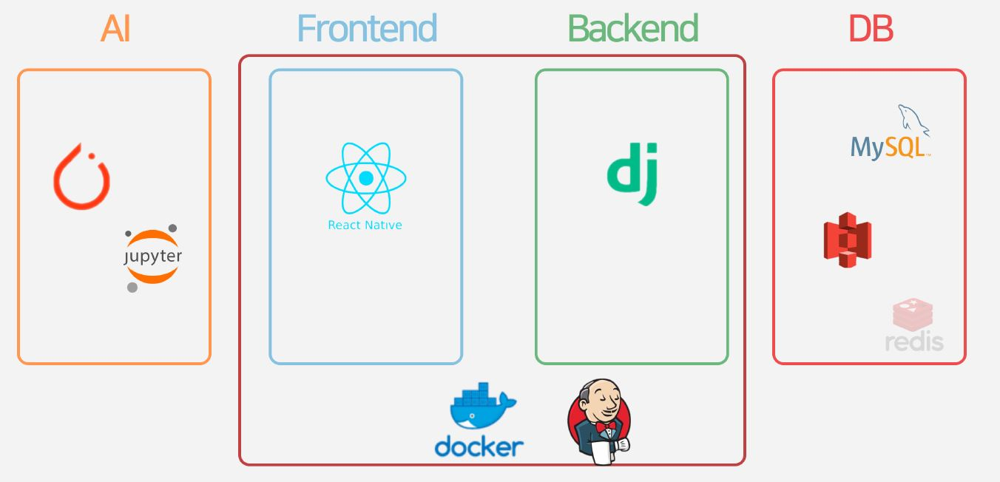
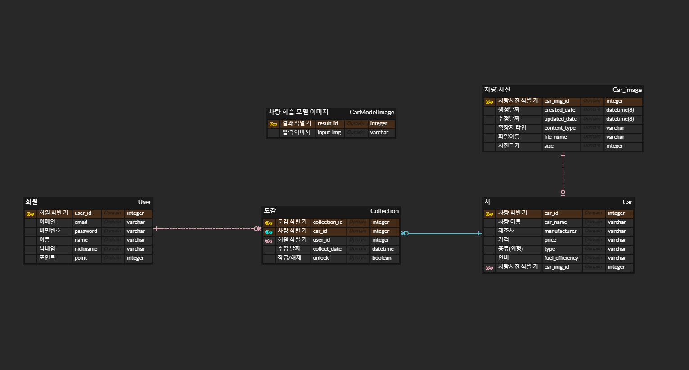
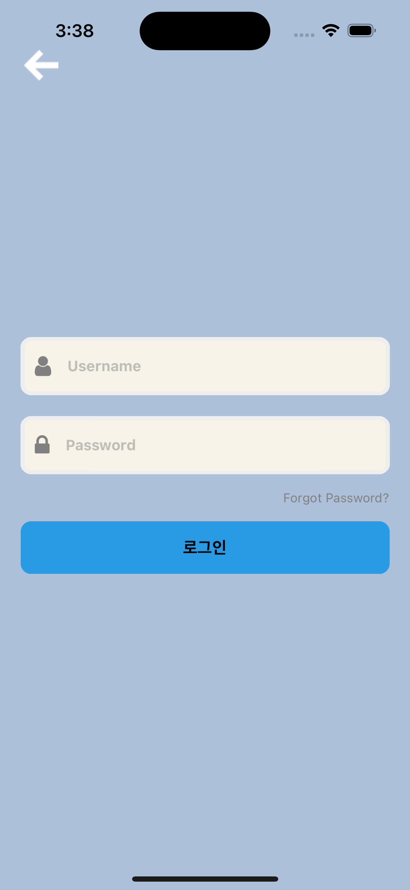
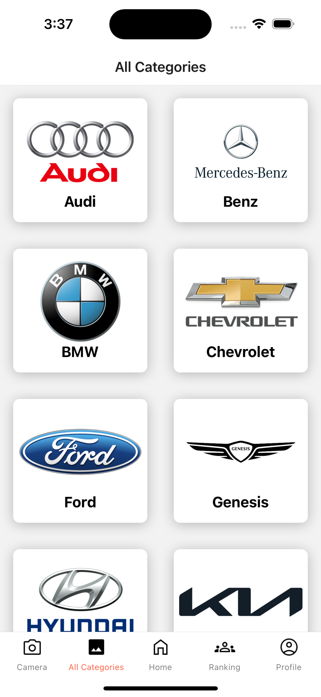
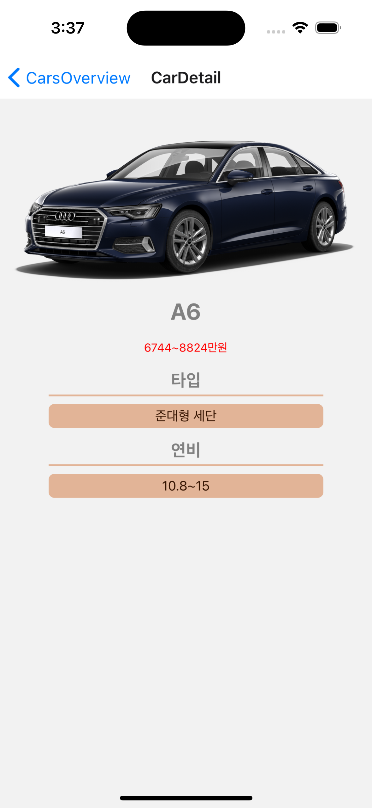
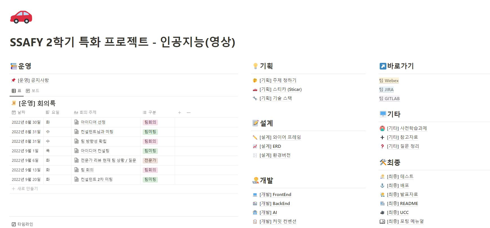

------------------

    <h1>
        STICAR - 차량 도감 어플리케이션
    </h1>

---------------------------------

##  👪 개발 멤버 소개

<table>
  <tr>
    <td height="140px" align="center">
      <a href="https://github.com/1992JYP">
        
          
        박주윤  (Back-End)
      </a>
       
    </td>
    <td height="140px" align="center">
      <a href="https://github.com/PIMA1233">
        
          
        유연길  (Front-End)
      </a>
       
    </td>
    <td height="140px" align="center">
      <a href="https://github.com/hanggeee">
        
          
        윤형준  (Front-End)
      </a>
       
    </td>
    <td height="140px" align="center">
      <a href="https://github.com/sangeun-lim">
        
          
        임상은  (Front-End)
      </a>
       
    </td>
    <td height="140px" align="center">
      <a href="https://github.com/Givem2thekey">
        
          
        조덕희  (Back-End)
      </a>
       
    </td>
  </tr>
  <tr>
    <td align="center">Backend DB AI </td>
    <td align="center">Fronted AI</td>
    <td align="center">Frontend AI</td>
    <td align="center">Frontend AI</td>
    <td align="center">Backend DB AI </td>
  </tr>
</table>

## 💡 서비스 소개

### 차량 도감 수집 어플리케이션

> 차종을 모르겠어 ! ==> 사진을 찍으면 차량의 정보를 알려주자
>
> 내가 본 자동차를 기록하고 싶어! ==> 자동차를 도감 형식으로 수집하게 하자
>
> 교통 법규나 표지판이 헷갈려 ==> 자연스럽게 지식을 습득하게 하자

----------------------------------

## 🛠️ 기술 스택

   

     

 

  

-------------------------------------

## 📂 시스템 아키텍처

### ERD

----------

## 💻 주요 기능

#### 1. 회원관리

- 회원가입

  

- 로그인

  

- 회원정보

- 비밀번호 찾기 및 변경

#### 2. 자동차 도감

- 카메라 인식

  

- 브랜드 기준 전체 도감 페이지

  

- 브랜드에 속한 차량 도감

  

- 차량 상세 페이지

  

  

#### 3. 랭킹 시스템

- 랭킹

  

------

## 👀 협업 관리

----------

## 📅 프로젝트 기간

- 기획 및 설계 : 22.8.22 ~ 22.10.7
- 프로젝트 구현 : 22.9.13 ~ 22.9.30
- 산출물 정리 : 22.10.4 ~ 22.10.7

---------------

## 🚗 앱 설치

[설치링크](https://drive.google.com/file/d/1VqMOBz14dCAAR4LZCOwONHzfCApKfH-d/view?usp=sharing)

----------

## 📑 프로젝트 관련 문서

[와이어프레임 바로 가기](https://www.figma.com/file/sTTUW361M42JFDu4WXBfV7/Diagram?node-id=0%3A1)

[팀 노션 바로 가기](https://amber-locket-f3e.notion.site/SSAFY-2-634ded7978e747c882bb142b2857d273)

[포팅메뉴얼](https://www.notion.so/fcfcfaf17db94475b481517283cca6b3)

-----------

## ✨ 학습 모델 링크
[학습모델](https://drive.google.com/file/d/1K6_H3Nps6j2hmG7b2kBClebyOKQcxyK3/view?usp=share_link)
