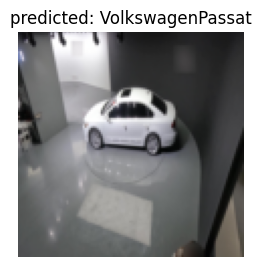
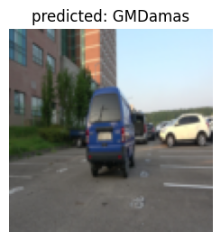

## 각종 필요한 라이브러리 설치


```python
# !pip install torch
# !pip install numpy
# !pip install torchvision
# !pip install matplotlib
# !pip install torchsummary
# pip install split-folders[full]  # train ,val, test 데이터 분리를 위한 split-folders 설치
```

### 데이터를 train(학습) 80% / val(검증) 10% / test(테스트) 10% 로 분류


```python
import splitfolders  
splitfolders.ratio("./32종원본", output="./test3", seed=77, ratio=(.8, .1, .1))
```

    Copying files: 16415 files [00:13, 1259.67 files/s]


### 각종 필요한 라이브러리를 임포트


```python
from __future__ import print_function, division
import torch
import torch.nn as nn 
import torch.optim as optim
from torch.optim import lr_scheduler # 학습률 스케쥴러 임포트
import numpy as np # 넘파이 임포트
import torchvision 
from torchvision import datasets, models, transforms
import matplotlib.pyplot as plt
import time
import os
import copy

os.environ['CUDA_LAUNCH_BLOCKING'] = "1"
# os.environ['CUDA_VISIBLE_DEVICES'] = "0,1,2,3,4,5,6,7,8"
# print(device)
plt.ion()   # 대화형 모드
```


    <matplotlib.pyplot._IonContext at 0x7ff724f6e970>


### 훈련 데이터 변형 및 데이터 resize


```python
data_transforms = {
	
    #훈련데이터
    'train': transforms.Compose([  # 이미지 변형시키기 여러가지 옵션들이 많으니 검색해서 원하는 옵션을 적용!
       transforms.Resize((112, 112)), # 224,224 사이즈로 이미지를 리사이즈 한다.
       transforms.RandomCrop(84), # 랜덤으로 자름 
       transforms.ColorJitter(brightness=0.2, contrast=0.2, saturation=0.2, hue=0.2), # 색 변조
        transforms.RandomHorizontalFlip(p = 1), # 수평으로 이미지 뒤집기
        transforms.ToTensor(), # 이미지 데이터를 tensor로 바꿔준다.
        transforms.Normalize([0.485, 0.456, 0.406], [0.229, 0.224, 0.225]) # 이미지 정규화
    ]),
    #검증데이터
    'val': transforms.Compose([
        transforms.Resize((112, 112)), # 이미지 사이즈를 resize로 변경한다.
        #transforms.CenterCrop(200), # 이미지 중앙을 resize × resize로 자른다
        transforms.ToTensor(), # 이미지 데이터를 tensor로 바꿔준다.
        transforms.Normalize([0.485, 0.456, 0.406], [0.229, 0.224, 0.225]) # 이미지 정규화
    ]),
	#테스트데이터
    'test': transforms.Compose([
        transforms.Resize((112, 112)), # 이미지 사이즈를 resize로 변경한다.
        #transforms.CenterCrop(200), # 이미지 중앙을 resize × resize로 자른다
        transforms.ToTensor(), # 이미지 데이터를 tensor로 바꿔준다.
        transforms.Normalize([0.485, 0.456, 0.406], [0.229, 0.224, 0.225]) # 이미지 정규화
    ]),
}

data_dir = './32종분류' # train, val, test 경로설정

image_datasets = {x: datasets.ImageFolder(os.path.join(data_dir, x), # 설정한 경로에서 이미지를 가져오고 리사이즈에서 데이터저장
                                          data_transforms[x])
                  for x in ['train', 'val','test']}

# image_datasets = {'train': datasets.ImageFolder(root='../test4/train', transform=data_transforms['train']),
#                  'val': datasets.ImageFolder(root='../test4/val', transform=data_transforms['val']),
#                  'test': datasets.ImageFolder(root='../test4/test', transform=data_transforms['test']),
#                  }
print(image_datasets)
```

    {'train': Dataset ImageFolder
        Number of datapoints: 13122
        Root location: ./32종분류/train
        StandardTransform
    Transform: Compose(
                   Resize(size=(112, 112), interpolation=bilinear, max_size=None, antialias=None)
                   RandomCrop(size=(84, 84), padding=None)
                   ColorJitter(brightness=[0.8, 1.2], contrast=[0.8, 1.2], saturation=[0.8, 1.2], hue=[-0.2, 0.2])
                   RandomHorizontalFlip(p=1)
                   ToTensor()
                   Normalize(mean=[0.485, 0.456, 0.406], std=[0.229, 0.224, 0.225])
               ), 'val': Dataset ImageFolder
        Number of datapoints: 1624
        Root location: ./32종분류/val
        StandardTransform
    Transform: Compose(
                   Resize(size=(112, 112), interpolation=bilinear, max_size=None, antialias=None)
                   ToTensor()
                   Normalize(mean=[0.485, 0.456, 0.406], std=[0.229, 0.224, 0.225])
               ), 'test': Dataset ImageFolder
        Number of datapoints: 1669
        Root location: ./32종분류/test
        StandardTransform
    Transform: Compose(
                   Resize(size=(112, 112), interpolation=bilinear, max_size=None, antialias=None)
                   ToTensor()
                   Normalize(mean=[0.485, 0.456, 0.406], std=[0.229, 0.224, 0.225])
               )}


```python
dataloaders = {x: torch.utils.data.DataLoader(image_datasets[x], batch_size=16, # 배치사이즈 32
                                             shuffle=True)
              for x in ['train', 'val', 'test']}
dataset_sizes = {x: len(image_datasets[x]) for x in ['train', 'val']}
# print(dataset_sizes)

class_names = image_datasets['train'].classes

device = torch.device("cuda" if torch.cuda.is_available() else "cpu") # gpu사용불가면 cpu를 사용.
```


```python
def imshow(inp, title=None): # 사용할 이미지의 일부를 보여줌(train)
    """Imshow for Tensor."""
    inp = inp.numpy().transpose((1, 2, 0))
    mean = np.array([0.485, 0.456, 0.406])
    std = np.array([0.229, 0.224, 0.225])
    inp = std * inp + mean
    inp = np.clip(inp, 0, 1)
    plt.imshow(inp)
    if title is not None:
        plt.title(title)
    plt.pause(0.001)  

inputs, classes = next(iter(dataloaders['train'])) # 학습 데이터의 배치를 얻습니다.
out = torchvision.utils.make_grid(inputs) # 배치로부터 격자 형태의 이미지를 만듭니다.

imshow(out, title=[class_names[x] for x in classes]) # 이미지 보여주기
```


    


### 사전학습 모델 불러오기
#### regnet 사용


```python
# models 사용가능 모델들 : https://pytorch.org/vision/stable/models.html 참고
# from torchvision.models import resnet50
# model = models.resnet50()
model = models.regnet_x_32gf(pretrained=True) #이미 학습된 모델 불러온다.
print(model) #모델 구조 출력
```

    /home/jupyter-j7c102/.local/lib/python3.9/site-packages/torchvision/models/_utils.py:208: UserWarning: The parameter 'pretrained' is deprecated since 0.13 and will be removed in 0.15, please use 'weights' instead.
      warnings.warn(
    /home/jupyter-j7c102/.local/lib/python3.9/site-packages/torchvision/models/_utils.py:223: UserWarning: Arguments other than a weight enum or `None` for 'weights' are deprecated since 0.13 and will be removed in 0.15. The current behavior is equivalent to passing `weights=RegNet_X_32GF_Weights.IMAGENET1K_V1`. You can also use `weights=RegNet_X_32GF_Weights.DEFAULT` to get the most up-to-date weights.
      warnings.warn(msg)


    RegNet(
      (stem): SimpleStemIN(
        (0): Conv2d(3, 32, kernel_size=(3, 3), stride=(2, 2), padding=(1, 1), bias=False)
        (1): BatchNorm2d(32, eps=1e-05, momentum=0.1, affine=True, track_running_stats=True)
        (2): ReLU(inplace=True)
      )
      (trunk_output): Sequential(
        (block1): AnyStage(
          (block1-0): ResBottleneckBlock(
            (proj): Conv2dNormActivation(
              (0): Conv2d(32, 336, kernel_size=(1, 1), stride=(2, 2), bias=False)
              (1): BatchNorm2d(336, eps=1e-05, momentum=0.1, affine=True, track_running_stats=True)
            )
            (f): BottleneckTransform(
              (a): Conv2dNormActivation(
                (0): Conv2d(32, 336, kernel_size=(1, 1), stride=(1, 1), bias=False)
                (1): BatchNorm2d(336, eps=1e-05, momentum=0.1, affine=True, track_running_stats=True)
                (2): ReLU(inplace=True)
              )
              (b): Conv2dNormActivation(
                (0): Conv2d(336, 336, kernel_size=(3, 3), stride=(2, 2), padding=(1, 1), groups=2, bias=False)
                (1): BatchNorm2d(336, eps=1e-05, momentum=0.1, affine=True, track_running_stats=True)
                (2): ReLU(inplace=True)
              )
              (c): Conv2dNormActivation(
                (0): Conv2d(336, 336, kernel_size=(1, 1), stride=(1, 1), bias=False)
                (1): BatchNorm2d(336, eps=1e-05, momentum=0.1, affine=True, track_running_stats=True)
              )
            )
            (activation): ReLU(inplace=True)
          )
          (block1-1): ResBottleneckBlock(
            (f): BottleneckTransform(
              (a): Conv2dNormActivation(
                (0): Conv2d(336, 336, kernel_size=(1, 1), stride=(1, 1), bias=False)
                (1): BatchNorm2d(336, eps=1e-05, momentum=0.1, affine=True, track_running_stats=True)
                (2): ReLU(inplace=True)
              )
              (b): Conv2dNormActivation(
                (0): Conv2d(336, 336, kernel_size=(3, 3), stride=(1, 1), padding=(1, 1), groups=2, bias=False)
                (1): BatchNorm2d(336, eps=1e-05, momentum=0.1, affine=True, track_running_stats=True)
                (2): ReLU(inplace=True)
              )
              (c): Conv2dNormActivation(
                (0): Conv2d(336, 336, kernel_size=(1, 1), stride=(1, 1), bias=False)
                (1): BatchNorm2d(336, eps=1e-05, momentum=0.1, affine=True, track_running_stats=True)
              )
            )
            (activation): ReLU(inplace=True)
          )
        )
        (block2): AnyStage(
          (block2-0): ResBottleneckBlock(
            (proj): Conv2dNormActivation(
              (0): Conv2d(336, 672, kernel_size=(1, 1), stride=(2, 2), bias=False)
              (1): BatchNorm2d(672, eps=1e-05, momentum=0.1, affine=True, track_running_stats=True)
            )
            (f): BottleneckTransform(
              (a): Conv2dNormActivation(
                (0): Conv2d(336, 672, kernel_size=(1, 1), stride=(1, 1), bias=False)
                (1): BatchNorm2d(672, eps=1e-05, momentum=0.1, affine=True, track_running_stats=True)
                (2): ReLU(inplace=True)
              )
              (b): Conv2dNormActivation(
                (0): Conv2d(672, 672, kernel_size=(3, 3), stride=(2, 2), padding=(1, 1), groups=4, bias=False)
                (1): BatchNorm2d(672, eps=1e-05, momentum=0.1, affine=True, track_running_stats=True)
                (2): ReLU(inplace=True)
              )
              (c): Conv2dNormActivation(
                (0): Conv2d(672, 672, kernel_size=(1, 1), stride=(1, 1), bias=False)
                (1): BatchNorm2d(672, eps=1e-05, momentum=0.1, affine=True, track_running_stats=True)
              )
            )
            (activation): ReLU(inplace=True)
          )
          (block2-1): ResBottleneckBlock(
            (f): BottleneckTransform(
              (a): Conv2dNormActivation(
                (0): Conv2d(672, 672, kernel_size=(1, 1), stride=(1, 1), bias=False)
                (1): BatchNorm2d(672, eps=1e-05, momentum=0.1, affine=True, track_running_stats=True)
                (2): ReLU(inplace=True)
              )
              (b): Conv2dNormActivation(
                (0): Conv2d(672, 672, kernel_size=(3, 3), stride=(1, 1), padding=(1, 1), groups=4, bias=False)
                (1): BatchNorm2d(672, eps=1e-05, momentum=0.1, affine=True, track_running_stats=True)
                (2): ReLU(inplace=True)
              )
              (c): Conv2dNormActivation(
                (0): Conv2d(672, 672, kernel_size=(1, 1), stride=(1, 1), bias=False)
                (1): BatchNorm2d(672, eps=1e-05, momentum=0.1, affine=True, track_running_stats=True)
              )
            )
            (activation): ReLU(inplace=True)
          )
          (block2-2): ResBottleneckBlock(
            (f): BottleneckTransform(
              (a): Conv2dNormActivation(
                (0): Conv2d(672, 672, kernel_size=(1, 1), stride=(1, 1), bias=False)
                (1): BatchNorm2d(672, eps=1e-05, momentum=0.1, affine=True, track_running_stats=True)
                (2): ReLU(inplace=True)
              )
              (b): Conv2dNormActivation(
                (0): Conv2d(672, 672, kernel_size=(3, 3), stride=(1, 1), padding=(1, 1), groups=4, bias=False)
                (1): BatchNorm2d(672, eps=1e-05, momentum=0.1, affine=True, track_running_stats=True)
                (2): ReLU(inplace=True)
              )
              (c): Conv2dNormActivation(
                (0): Conv2d(672, 672, kernel_size=(1, 1), stride=(1, 1), bias=False)
                (1): BatchNorm2d(672, eps=1e-05, momentum=0.1, affine=True, track_running_stats=True)
              )
            )
            (activation): ReLU(inplace=True)
          )
          (block2-3): ResBottleneckBlock(
            (f): BottleneckTransform(
              (a): Conv2dNormActivation(
                (0): Conv2d(672, 672, kernel_size=(1, 1), stride=(1, 1), bias=False)
                (1): BatchNorm2d(672, eps=1e-05, momentum=0.1, affine=True, track_running_stats=True)
                (2): ReLU(inplace=True)
              )
              (b): Conv2dNormActivation(
                (0): Conv2d(672, 672, kernel_size=(3, 3), stride=(1, 1), padding=(1, 1), groups=4, bias=False)
                (1): BatchNorm2d(672, eps=1e-05, momentum=0.1, affine=True, track_running_stats=True)
                (2): ReLU(inplace=True)
              )
              (c): Conv2dNormActivation(
                (0): Conv2d(672, 672, kernel_size=(1, 1), stride=(1, 1), bias=False)
                (1): BatchNorm2d(672, eps=1e-05, momentum=0.1, affine=True, track_running_stats=True)
              )
            )
            (activation): ReLU(inplace=True)
          )
          (block2-4): ResBottleneckBlock(
            (f): BottleneckTransform(
              (a): Conv2dNormActivation(
                (0): Conv2d(672, 672, kernel_size=(1, 1), stride=(1, 1), bias=False)
                (1): BatchNorm2d(672, eps=1e-05, momentum=0.1, affine=True, track_running_stats=True)
                (2): ReLU(inplace=True)
              )
              (b): Conv2dNormActivation(
                (0): Conv2d(672, 672, kernel_size=(3, 3), stride=(1, 1), padding=(1, 1), groups=4, bias=False)
                (1): BatchNorm2d(672, eps=1e-05, momentum=0.1, affine=True, track_running_stats=True)
                (2): ReLU(inplace=True)
              )
              (c): Conv2dNormActivation(
                (0): Conv2d(672, 672, kernel_size=(1, 1), stride=(1, 1), bias=False)
                (1): BatchNorm2d(672, eps=1e-05, momentum=0.1, affine=True, track_running_stats=True)
              )
            )
            (activation): ReLU(inplace=True)
          )
          (block2-5): ResBottleneckBlock(
            (f): BottleneckTransform(
              (a): Conv2dNormActivation(
                (0): Conv2d(672, 672, kernel_size=(1, 1), stride=(1, 1), bias=False)
                (1): BatchNorm2d(672, eps=1e-05, momentum=0.1, affine=True, track_running_stats=True)
                (2): ReLU(inplace=True)
              )
              (b): Conv2dNormActivation(
                (0): Conv2d(672, 672, kernel_size=(3, 3), stride=(1, 1), padding=(1, 1), groups=4, bias=False)
                (1): BatchNorm2d(672, eps=1e-05, momentum=0.1, affine=True, track_running_stats=True)
                (2): ReLU(inplace=True)
              )
              (c): Conv2dNormActivation(
                (0): Conv2d(672, 672, kernel_size=(1, 1), stride=(1, 1), bias=False)
                (1): BatchNorm2d(672, eps=1e-05, momentum=0.1, affine=True, track_running_stats=True)
              )
            )
            (activation): ReLU(inplace=True)
          )
          (block2-6): ResBottleneckBlock(
            (f): BottleneckTransform(
              (a): Conv2dNormActivation(
                (0): Conv2d(672, 672, kernel_size=(1, 1), stride=(1, 1), bias=False)
                (1): BatchNorm2d(672, eps=1e-05, momentum=0.1, affine=True, track_running_stats=True)
                (2): ReLU(inplace=True)
              )
              (b): Conv2dNormActivation(
                (0): Conv2d(672, 672, kernel_size=(3, 3), stride=(1, 1), padding=(1, 1), groups=4, bias=False)
                (1): BatchNorm2d(672, eps=1e-05, momentum=0.1, affine=True, track_running_stats=True)
                (2): ReLU(inplace=True)
              )
              (c): Conv2dNormActivation(
                (0): Conv2d(672, 672, kernel_size=(1, 1), stride=(1, 1), bias=False)
                (1): BatchNorm2d(672, eps=1e-05, momentum=0.1, affine=True, track_running_stats=True)
              )
            )
            (activation): ReLU(inplace=True)
          )
        )
        (block3): AnyStage(
          (block3-0): ResBottleneckBlock(
            (proj): Conv2dNormActivation(
              (0): Conv2d(672, 1344, kernel_size=(1, 1), stride=(2, 2), bias=False)
              (1): BatchNorm2d(1344, eps=1e-05, momentum=0.1, affine=True, track_running_stats=True)
            )
            (f): BottleneckTransform(
              (a): Conv2dNormActivation(
                (0): Conv2d(672, 1344, kernel_size=(1, 1), stride=(1, 1), bias=False)
                (1): BatchNorm2d(1344, eps=1e-05, momentum=0.1, affine=True, track_running_stats=True)
                (2): ReLU(inplace=True)
              )
              (b): Conv2dNormActivation(
                (0): Conv2d(1344, 1344, kernel_size=(3, 3), stride=(2, 2), padding=(1, 1), groups=8, bias=False)
                (1): BatchNorm2d(1344, eps=1e-05, momentum=0.1, affine=True, track_running_stats=True)
                (2): ReLU(inplace=True)
              )
              (c): Conv2dNormActivation(
                (0): Conv2d(1344, 1344, kernel_size=(1, 1), stride=(1, 1), bias=False)
                (1): BatchNorm2d(1344, eps=1e-05, momentum=0.1, affine=True, track_running_stats=True)
              )
            )
            (activation): ReLU(inplace=True)
          )
          (block3-1): ResBottleneckBlock(
            (f): BottleneckTransform(
              (a): Conv2dNormActivation(
                (0): Conv2d(1344, 1344, kernel_size=(1, 1), stride=(1, 1), bias=False)
                (1): BatchNorm2d(1344, eps=1e-05, momentum=0.1, affine=True, track_running_stats=True)
                (2): ReLU(inplace=True)
              )
              (b): Conv2dNormActivation(
                (0): Conv2d(1344, 1344, kernel_size=(3, 3), stride=(1, 1), padding=(1, 1), groups=8, bias=False)
                (1): BatchNorm2d(1344, eps=1e-05, momentum=0.1, affine=True, track_running_stats=True)
                (2): ReLU(inplace=True)
              )
              (c): Conv2dNormActivation(
                (0): Conv2d(1344, 1344, kernel_size=(1, 1), stride=(1, 1), bias=False)
                (1): BatchNorm2d(1344, eps=1e-05, momentum=0.1, affine=True, track_running_stats=True)
              )
            )
            (activation): ReLU(inplace=True)
          )
          (block3-2): ResBottleneckBlock(
            (f): BottleneckTransform(
              (a): Conv2dNormActivation(
                (0): Conv2d(1344, 1344, kernel_size=(1, 1), stride=(1, 1), bias=False)
                (1): BatchNorm2d(1344, eps=1e-05, momentum=0.1, affine=True, track_running_stats=True)
                (2): ReLU(inplace=True)
              )
              (b): Conv2dNormActivation(
                (0): Conv2d(1344, 1344, kernel_size=(3, 3), stride=(1, 1), padding=(1, 1), groups=8, bias=False)
                (1): BatchNorm2d(1344, eps=1e-05, momentum=0.1, affine=True, track_running_stats=True)
                (2): ReLU(inplace=True)
              )
              (c): Conv2dNormActivation(
                (0): Conv2d(1344, 1344, kernel_size=(1, 1), stride=(1, 1), bias=False)
                (1): BatchNorm2d(1344, eps=1e-05, momentum=0.1, affine=True, track_running_stats=True)
              )
            )
            (activation): ReLU(inplace=True)
          )
          (block3-3): ResBottleneckBlock(
            (f): BottleneckTransform(
              (a): Conv2dNormActivation(
                (0): Conv2d(1344, 1344, kernel_size=(1, 1), stride=(1, 1), bias=False)
                (1): BatchNorm2d(1344, eps=1e-05, momentum=0.1, affine=True, track_running_stats=True)
                (2): ReLU(inplace=True)
              )
              (b): Conv2dNormActivation(
                (0): Conv2d(1344, 1344, kernel_size=(3, 3), stride=(1, 1), padding=(1, 1), groups=8, bias=False)
                (1): BatchNorm2d(1344, eps=1e-05, momentum=0.1, affine=True, track_running_stats=True)
                (2): ReLU(inplace=True)
              )
              (c): Conv2dNormActivation(
                (0): Conv2d(1344, 1344, kernel_size=(1, 1), stride=(1, 1), bias=False)
                (1): BatchNorm2d(1344, eps=1e-05, momentum=0.1, affine=True, track_running_stats=True)
              )
            )
            (activation): ReLU(inplace=True)
          )
          (block3-4): ResBottleneckBlock(
            (f): BottleneckTransform(
              (a): Conv2dNormActivation(
                (0): Conv2d(1344, 1344, kernel_size=(1, 1), stride=(1, 1), bias=False)
                (1): BatchNorm2d(1344, eps=1e-05, momentum=0.1, affine=True, track_running_stats=True)
                (2): ReLU(inplace=True)
              )
              (b): Conv2dNormActivation(
                (0): Conv2d(1344, 1344, kernel_size=(3, 3), stride=(1, 1), padding=(1, 1), groups=8, bias=False)
                (1): BatchNorm2d(1344, eps=1e-05, momentum=0.1, affine=True, track_running_stats=True)
                (2): ReLU(inplace=True)
              )
              (c): Conv2dNormActivation(
                (0): Conv2d(1344, 1344, kernel_size=(1, 1), stride=(1, 1), bias=False)
                (1): BatchNorm2d(1344, eps=1e-05, momentum=0.1, affine=True, track_running_stats=True)
              )
            )
            (activation): ReLU(inplace=True)
          )
          (block3-5): ResBottleneckBlock(
            (f): BottleneckTransform(
              (a): Conv2dNormActivation(
                (0): Conv2d(1344, 1344, kernel_size=(1, 1), stride=(1, 1), bias=False)
                (1): BatchNorm2d(1344, eps=1e-05, momentum=0.1, affine=True, track_running_stats=True)
                (2): ReLU(inplace=True)
              )
              (b): Conv2dNormActivation(
                (0): Conv2d(1344, 1344, kernel_size=(3, 3), stride=(1, 1), padding=(1, 1), groups=8, bias=False)
                (1): BatchNorm2d(1344, eps=1e-05, momentum=0.1, affine=True, track_running_stats=True)
                (2): ReLU(inplace=True)
              )
              (c): Conv2dNormActivation(
                (0): Conv2d(1344, 1344, kernel_size=(1, 1), stride=(1, 1), bias=False)
                (1): BatchNorm2d(1344, eps=1e-05, momentum=0.1, affine=True, track_running_stats=True)
              )
            )
            (activation): ReLU(inplace=True)
          )
          (block3-6): ResBottleneckBlock(
            (f): BottleneckTransform(
              (a): Conv2dNormActivation(
                (0): Conv2d(1344, 1344, kernel_size=(1, 1), stride=(1, 1), bias=False)
                (1): BatchNorm2d(1344, eps=1e-05, momentum=0.1, affine=True, track_running_stats=True)
                (2): ReLU(inplace=True)
              )
              (b): Conv2dNormActivation(
                (0): Conv2d(1344, 1344, kernel_size=(3, 3), stride=(1, 1), padding=(1, 1), groups=8, bias=False)
                (1): BatchNorm2d(1344, eps=1e-05, momentum=0.1, affine=True, track_running_stats=True)
                (2): ReLU(inplace=True)
              )
              (c): Conv2dNormActivation(
                (0): Conv2d(1344, 1344, kernel_size=(1, 1), stride=(1, 1), bias=False)
                (1): BatchNorm2d(1344, eps=1e-05, momentum=0.1, affine=True, track_running_stats=True)
              )
            )
            (activation): ReLU(inplace=True)
          )
          (block3-7): ResBottleneckBlock(
            (f): BottleneckTransform(
              (a): Conv2dNormActivation(
                (0): Conv2d(1344, 1344, kernel_size=(1, 1), stride=(1, 1), bias=False)
                (1): BatchNorm2d(1344, eps=1e-05, momentum=0.1, affine=True, track_running_stats=True)
                (2): ReLU(inplace=True)
              )
              (b): Conv2dNormActivation(
                (0): Conv2d(1344, 1344, kernel_size=(3, 3), stride=(1, 1), padding=(1, 1), groups=8, bias=False)
                (1): BatchNorm2d(1344, eps=1e-05, momentum=0.1, affine=True, track_running_stats=True)
                (2): ReLU(inplace=True)
              )
              (c): Conv2dNormActivation(
                (0): Conv2d(1344, 1344, kernel_size=(1, 1), stride=(1, 1), bias=False)
                (1): BatchNorm2d(1344, eps=1e-05, momentum=0.1, affine=True, track_running_stats=True)
              )
            )
            (activation): ReLU(inplace=True)
          )
          (block3-8): ResBottleneckBlock(
            (f): BottleneckTransform(
              (a): Conv2dNormActivation(
                (0): Conv2d(1344, 1344, kernel_size=(1, 1), stride=(1, 1), bias=False)
                (1): BatchNorm2d(1344, eps=1e-05, momentum=0.1, affine=True, track_running_stats=True)
                (2): ReLU(inplace=True)
              )
              (b): Conv2dNormActivation(
                (0): Conv2d(1344, 1344, kernel_size=(3, 3), stride=(1, 1), padding=(1, 1), groups=8, bias=False)
                (1): BatchNorm2d(1344, eps=1e-05, momentum=0.1, affine=True, track_running_stats=True)
                (2): ReLU(inplace=True)
              )
              (c): Conv2dNormActivation(
                (0): Conv2d(1344, 1344, kernel_size=(1, 1), stride=(1, 1), bias=False)
                (1): BatchNorm2d(1344, eps=1e-05, momentum=0.1, affine=True, track_running_stats=True)
              )
            )
            (activation): ReLU(inplace=True)
          )
          (block3-9): ResBottleneckBlock(
            (f): BottleneckTransform(
              (a): Conv2dNormActivation(
                (0): Conv2d(1344, 1344, kernel_size=(1, 1), stride=(1, 1), bias=False)
                (1): BatchNorm2d(1344, eps=1e-05, momentum=0.1, affine=True, track_running_stats=True)
                (2): ReLU(inplace=True)
              )
              (b): Conv2dNormActivation(
                (0): Conv2d(1344, 1344, kernel_size=(3, 3), stride=(1, 1), padding=(1, 1), groups=8, bias=False)
                (1): BatchNorm2d(1344, eps=1e-05, momentum=0.1, affine=True, track_running_stats=True)
                (2): ReLU(inplace=True)
              )
              (c): Conv2dNormActivation(
                (0): Conv2d(1344, 1344, kernel_size=(1, 1), stride=(1, 1), bias=False)
                (1): BatchNorm2d(1344, eps=1e-05, momentum=0.1, affine=True, track_running_stats=True)
              )
            )
            (activation): ReLU(inplace=True)
          )
          (block3-10): ResBottleneckBlock(
            (f): BottleneckTransform(
              (a): Conv2dNormActivation(
                (0): Conv2d(1344, 1344, kernel_size=(1, 1), stride=(1, 1), bias=False)
                (1): BatchNorm2d(1344, eps=1e-05, momentum=0.1, affine=True, track_running_stats=True)
                (2): ReLU(inplace=True)
              )
              (b): Conv2dNormActivation(
                (0): Conv2d(1344, 1344, kernel_size=(3, 3), stride=(1, 1), padding=(1, 1), groups=8, bias=False)
                (1): BatchNorm2d(1344, eps=1e-05, momentum=0.1, affine=True, track_running_stats=True)
                (2): ReLU(inplace=True)
              )
              (c): Conv2dNormActivation(
                (0): Conv2d(1344, 1344, kernel_size=(1, 1), stride=(1, 1), bias=False)
                (1): BatchNorm2d(1344, eps=1e-05, momentum=0.1, affine=True, track_running_stats=True)
              )
            )
            (activation): ReLU(inplace=True)
          )
          (block3-11): ResBottleneckBlock(
            (f): BottleneckTransform(
              (a): Conv2dNormActivation(
                (0): Conv2d(1344, 1344, kernel_size=(1, 1), stride=(1, 1), bias=False)
                (1): BatchNorm2d(1344, eps=1e-05, momentum=0.1, affine=True, track_running_stats=True)
                (2): ReLU(inplace=True)
              )
              (b): Conv2dNormActivation(
                (0): Conv2d(1344, 1344, kernel_size=(3, 3), stride=(1, 1), padding=(1, 1), groups=8, bias=False)
                (1): BatchNorm2d(1344, eps=1e-05, momentum=0.1, affine=True, track_running_stats=True)
                (2): ReLU(inplace=True)
              )
              (c): Conv2dNormActivation(
                (0): Conv2d(1344, 1344, kernel_size=(1, 1), stride=(1, 1), bias=False)
                (1): BatchNorm2d(1344, eps=1e-05, momentum=0.1, affine=True, track_running_stats=True)
              )
            )
            (activation): ReLU(inplace=True)
          )
          (block3-12): ResBottleneckBlock(
            (f): BottleneckTransform(
              (a): Conv2dNormActivation(
                (0): Conv2d(1344, 1344, kernel_size=(1, 1), stride=(1, 1), bias=False)
                (1): BatchNorm2d(1344, eps=1e-05, momentum=0.1, affine=True, track_running_stats=True)
                (2): ReLU(inplace=True)
              )
              (b): Conv2dNormActivation(
                (0): Conv2d(1344, 1344, kernel_size=(3, 3), stride=(1, 1), padding=(1, 1), groups=8, bias=False)
                (1): BatchNorm2d(1344, eps=1e-05, momentum=0.1, affine=True, track_running_stats=True)
                (2): ReLU(inplace=True)
              )
              (c): Conv2dNormActivation(
                (0): Conv2d(1344, 1344, kernel_size=(1, 1), stride=(1, 1), bias=False)
                (1): BatchNorm2d(1344, eps=1e-05, momentum=0.1, affine=True, track_running_stats=True)
              )
            )
            (activation): ReLU(inplace=True)
          )
        )
        (block4): AnyStage(
          (block4-0): ResBottleneckBlock(
            (proj): Conv2dNormActivation(
              (0): Conv2d(1344, 2520, kernel_size=(1, 1), stride=(2, 2), bias=False)
              (1): BatchNorm2d(2520, eps=1e-05, momentum=0.1, affine=True, track_running_stats=True)
            )
            (f): BottleneckTransform(
              (a): Conv2dNormActivation(
                (0): Conv2d(1344, 2520, kernel_size=(1, 1), stride=(1, 1), bias=False)
                (1): BatchNorm2d(2520, eps=1e-05, momentum=0.1, affine=True, track_running_stats=True)
                (2): ReLU(inplace=True)
              )
              (b): Conv2dNormActivation(
                (0): Conv2d(2520, 2520, kernel_size=(3, 3), stride=(2, 2), padding=(1, 1), groups=15, bias=False)
                (1): BatchNorm2d(2520, eps=1e-05, momentum=0.1, affine=True, track_running_stats=True)
                (2): ReLU(inplace=True)
              )
              (c): Conv2dNormActivation(
                (0): Conv2d(2520, 2520, kernel_size=(1, 1), stride=(1, 1), bias=False)
                (1): BatchNorm2d(2520, eps=1e-05, momentum=0.1, affine=True, track_running_stats=True)
              )
            )
            (activation): ReLU(inplace=True)
          )
        )
      )
      (avgpool): AdaptiveAvgPool2d(output_size=(1, 1))
      (fc): Linear(in_features=2520, out_features=1000, bias=True)
    )


#### 출력층을 사용하는 데이터에 맞게  out_features를 1000개에서 32개로 변형


```python
model.fc=nn.Linear(in_features=2520, out_features=32) # 마지막 출력층을 나의 class 수에 맞춰서 바꿔준다.
print(model) # 바뀐모델 구조 출력
criterion = nn.CrossEntropyLoss() # 손실함수(loss function) 크로스 엔트로피 사용
```

    RegNet(
      (stem): SimpleStemIN(
        (0): Conv2d(3, 32, kernel_size=(3, 3), stride=(2, 2), padding=(1, 1), bias=False)
        (1): BatchNorm2d(32, eps=1e-05, momentum=0.1, affine=True, track_running_stats=True)
        (2): ReLU(inplace=True)
      )
      (trunk_output): Sequential(
        (block1): AnyStage(
          (block1-0): ResBottleneckBlock(
            (proj): Conv2dNormActivation(
              (0): Conv2d(32, 336, kernel_size=(1, 1), stride=(2, 2), bias=False)
              (1): BatchNorm2d(336, eps=1e-05, momentum=0.1, affine=True, track_running_stats=True)
            )
            (f): BottleneckTransform(
              (a): Conv2dNormActivation(
                (0): Conv2d(32, 336, kernel_size=(1, 1), stride=(1, 1), bias=False)
                (1): BatchNorm2d(336, eps=1e-05, momentum=0.1, affine=True, track_running_stats=True)
                (2): ReLU(inplace=True)
              )
              (b): Conv2dNormActivation(
                (0): Conv2d(336, 336, kernel_size=(3, 3), stride=(2, 2), padding=(1, 1), groups=2, bias=False)
                (1): BatchNorm2d(336, eps=1e-05, momentum=0.1, affine=True, track_running_stats=True)
                (2): ReLU(inplace=True)
              )
              (c): Conv2dNormActivation(
                (0): Conv2d(336, 336, kernel_size=(1, 1), stride=(1, 1), bias=False)
                (1): BatchNorm2d(336, eps=1e-05, momentum=0.1, affine=True, track_running_stats=True)
              )
            )
            (activation): ReLU(inplace=True)
          )
          (block1-1): ResBottleneckBlock(
            (f): BottleneckTransform(
              (a): Conv2dNormActivation(
                (0): Conv2d(336, 336, kernel_size=(1, 1), stride=(1, 1), bias=False)
                (1): BatchNorm2d(336, eps=1e-05, momentum=0.1, affine=True, track_running_stats=True)
                (2): ReLU(inplace=True)
              )
              (b): Conv2dNormActivation(
                (0): Conv2d(336, 336, kernel_size=(3, 3), stride=(1, 1), padding=(1, 1), groups=2, bias=False)
                (1): BatchNorm2d(336, eps=1e-05, momentum=0.1, affine=True, track_running_stats=True)
                (2): ReLU(inplace=True)
              )
              (c): Conv2dNormActivation(
                (0): Conv2d(336, 336, kernel_size=(1, 1), stride=(1, 1), bias=False)
                (1): BatchNorm2d(336, eps=1e-05, momentum=0.1, affine=True, track_running_stats=True)
              )
            )
            (activation): ReLU(inplace=True)
          )
        )
        (block2): AnyStage(
          (block2-0): ResBottleneckBlock(
            (proj): Conv2dNormActivation(
              (0): Conv2d(336, 672, kernel_size=(1, 1), stride=(2, 2), bias=False)
              (1): BatchNorm2d(672, eps=1e-05, momentum=0.1, affine=True, track_running_stats=True)
            )
            (f): BottleneckTransform(
              (a): Conv2dNormActivation(
                (0): Conv2d(336, 672, kernel_size=(1, 1), stride=(1, 1), bias=False)
                (1): BatchNorm2d(672, eps=1e-05, momentum=0.1, affine=True, track_running_stats=True)
                (2): ReLU(inplace=True)
              )
              (b): Conv2dNormActivation(
                (0): Conv2d(672, 672, kernel_size=(3, 3), stride=(2, 2), padding=(1, 1), groups=4, bias=False)
                (1): BatchNorm2d(672, eps=1e-05, momentum=0.1, affine=True, track_running_stats=True)
                (2): ReLU(inplace=True)
              )
              (c): Conv2dNormActivation(
                (0): Conv2d(672, 672, kernel_size=(1, 1), stride=(1, 1), bias=False)
                (1): BatchNorm2d(672, eps=1e-05, momentum=0.1, affine=True, track_running_stats=True)
              )
            )
            (activation): ReLU(inplace=True)
          )
          (block2-1): ResBottleneckBlock(
            (f): BottleneckTransform(
              (a): Conv2dNormActivation(
                (0): Conv2d(672, 672, kernel_size=(1, 1), stride=(1, 1), bias=False)
                (1): BatchNorm2d(672, eps=1e-05, momentum=0.1, affine=True, track_running_stats=True)
                (2): ReLU(inplace=True)
              )
              (b): Conv2dNormActivation(
                (0): Conv2d(672, 672, kernel_size=(3, 3), stride=(1, 1), padding=(1, 1), groups=4, bias=False)
                (1): BatchNorm2d(672, eps=1e-05, momentum=0.1, affine=True, track_running_stats=True)
                (2): ReLU(inplace=True)
              )
              (c): Conv2dNormActivation(
                (0): Conv2d(672, 672, kernel_size=(1, 1), stride=(1, 1), bias=False)
                (1): BatchNorm2d(672, eps=1e-05, momentum=0.1, affine=True, track_running_stats=True)
              )
            )
            (activation): ReLU(inplace=True)
          )
          (block2-2): ResBottleneckBlock(
            (f): BottleneckTransform(
              (a): Conv2dNormActivation(
                (0): Conv2d(672, 672, kernel_size=(1, 1), stride=(1, 1), bias=False)
                (1): BatchNorm2d(672, eps=1e-05, momentum=0.1, affine=True, track_running_stats=True)
                (2): ReLU(inplace=True)
              )
              (b): Conv2dNormActivation(
                (0): Conv2d(672, 672, kernel_size=(3, 3), stride=(1, 1), padding=(1, 1), groups=4, bias=False)
                (1): BatchNorm2d(672, eps=1e-05, momentum=0.1, affine=True, track_running_stats=True)
                (2): ReLU(inplace=True)
              )
              (c): Conv2dNormActivation(
                (0): Conv2d(672, 672, kernel_size=(1, 1), stride=(1, 1), bias=False)
                (1): BatchNorm2d(672, eps=1e-05, momentum=0.1, affine=True, track_running_stats=True)
              )
            )
            (activation): ReLU(inplace=True)
          )
          (block2-3): ResBottleneckBlock(
            (f): BottleneckTransform(
              (a): Conv2dNormActivation(
                (0): Conv2d(672, 672, kernel_size=(1, 1), stride=(1, 1), bias=False)
                (1): BatchNorm2d(672, eps=1e-05, momentum=0.1, affine=True, track_running_stats=True)
                (2): ReLU(inplace=True)
              )
              (b): Conv2dNormActivation(
                (0): Conv2d(672, 672, kernel_size=(3, 3), stride=(1, 1), padding=(1, 1), groups=4, bias=False)
                (1): BatchNorm2d(672, eps=1e-05, momentum=0.1, affine=True, track_running_stats=True)
                (2): ReLU(inplace=True)
              )
              (c): Conv2dNormActivation(
                (0): Conv2d(672, 672, kernel_size=(1, 1), stride=(1, 1), bias=False)
                (1): BatchNorm2d(672, eps=1e-05, momentum=0.1, affine=True, track_running_stats=True)
              )
            )
            (activation): ReLU(inplace=True)
          )
          (block2-4): ResBottleneckBlock(
            (f): BottleneckTransform(
              (a): Conv2dNormActivation(
                (0): Conv2d(672, 672, kernel_size=(1, 1), stride=(1, 1), bias=False)
                (1): BatchNorm2d(672, eps=1e-05, momentum=0.1, affine=True, track_running_stats=True)
                (2): ReLU(inplace=True)
              )
              (b): Conv2dNormActivation(
                (0): Conv2d(672, 672, kernel_size=(3, 3), stride=(1, 1), padding=(1, 1), groups=4, bias=False)
                (1): BatchNorm2d(672, eps=1e-05, momentum=0.1, affine=True, track_running_stats=True)
                (2): ReLU(inplace=True)
              )
              (c): Conv2dNormActivation(
                (0): Conv2d(672, 672, kernel_size=(1, 1), stride=(1, 1), bias=False)
                (1): BatchNorm2d(672, eps=1e-05, momentum=0.1, affine=True, track_running_stats=True)
              )
            )
            (activation): ReLU(inplace=True)
          )
          (block2-5): ResBottleneckBlock(
            (f): BottleneckTransform(
              (a): Conv2dNormActivation(
                (0): Conv2d(672, 672, kernel_size=(1, 1), stride=(1, 1), bias=False)
                (1): BatchNorm2d(672, eps=1e-05, momentum=0.1, affine=True, track_running_stats=True)
                (2): ReLU(inplace=True)
              )
              (b): Conv2dNormActivation(
                (0): Conv2d(672, 672, kernel_size=(3, 3), stride=(1, 1), padding=(1, 1), groups=4, bias=False)
                (1): BatchNorm2d(672, eps=1e-05, momentum=0.1, affine=True, track_running_stats=True)
                (2): ReLU(inplace=True)
              )
              (c): Conv2dNormActivation(
                (0): Conv2d(672, 672, kernel_size=(1, 1), stride=(1, 1), bias=False)
                (1): BatchNorm2d(672, eps=1e-05, momentum=0.1, affine=True, track_running_stats=True)
              )
            )
            (activation): ReLU(inplace=True)
          )
          (block2-6): ResBottleneckBlock(
            (f): BottleneckTransform(
              (a): Conv2dNormActivation(
                (0): Conv2d(672, 672, kernel_size=(1, 1), stride=(1, 1), bias=False)
                (1): BatchNorm2d(672, eps=1e-05, momentum=0.1, affine=True, track_running_stats=True)
                (2): ReLU(inplace=True)
              )
              (b): Conv2dNormActivation(
                (0): Conv2d(672, 672, kernel_size=(3, 3), stride=(1, 1), padding=(1, 1), groups=4, bias=False)
                (1): BatchNorm2d(672, eps=1e-05, momentum=0.1, affine=True, track_running_stats=True)
                (2): ReLU(inplace=True)
              )
              (c): Conv2dNormActivation(
                (0): Conv2d(672, 672, kernel_size=(1, 1), stride=(1, 1), bias=False)
                (1): BatchNorm2d(672, eps=1e-05, momentum=0.1, affine=True, track_running_stats=True)
              )
            )
            (activation): ReLU(inplace=True)
          )
        )
        (block3): AnyStage(
          (block3-0): ResBottleneckBlock(
            (proj): Conv2dNormActivation(
              (0): Conv2d(672, 1344, kernel_size=(1, 1), stride=(2, 2), bias=False)
              (1): BatchNorm2d(1344, eps=1e-05, momentum=0.1, affine=True, track_running_stats=True)
            )
            (f): BottleneckTransform(
              (a): Conv2dNormActivation(
                (0): Conv2d(672, 1344, kernel_size=(1, 1), stride=(1, 1), bias=False)
                (1): BatchNorm2d(1344, eps=1e-05, momentum=0.1, affine=True, track_running_stats=True)
                (2): ReLU(inplace=True)
              )
              (b): Conv2dNormActivation(
                (0): Conv2d(1344, 1344, kernel_size=(3, 3), stride=(2, 2), padding=(1, 1), groups=8, bias=False)
                (1): BatchNorm2d(1344, eps=1e-05, momentum=0.1, affine=True, track_running_stats=True)
                (2): ReLU(inplace=True)
              )
              (c): Conv2dNormActivation(
                (0): Conv2d(1344, 1344, kernel_size=(1, 1), stride=(1, 1), bias=False)
                (1): BatchNorm2d(1344, eps=1e-05, momentum=0.1, affine=True, track_running_stats=True)
              )
            )
            (activation): ReLU(inplace=True)
          )
          (block3-1): ResBottleneckBlock(
            (f): BottleneckTransform(
              (a): Conv2dNormActivation(
                (0): Conv2d(1344, 1344, kernel_size=(1, 1), stride=(1, 1), bias=False)
                (1): BatchNorm2d(1344, eps=1e-05, momentum=0.1, affine=True, track_running_stats=True)
                (2): ReLU(inplace=True)
              )
              (b): Conv2dNormActivation(
                (0): Conv2d(1344, 1344, kernel_size=(3, 3), stride=(1, 1), padding=(1, 1), groups=8, bias=False)
                (1): BatchNorm2d(1344, eps=1e-05, momentum=0.1, affine=True, track_running_stats=True)
                (2): ReLU(inplace=True)
              )
              (c): Conv2dNormActivation(
                (0): Conv2d(1344, 1344, kernel_size=(1, 1), stride=(1, 1), bias=False)
                (1): BatchNorm2d(1344, eps=1e-05, momentum=0.1, affine=True, track_running_stats=True)
              )
            )
            (activation): ReLU(inplace=True)
          )
          (block3-2): ResBottleneckBlock(
            (f): BottleneckTransform(
              (a): Conv2dNormActivation(
                (0): Conv2d(1344, 1344, kernel_size=(1, 1), stride=(1, 1), bias=False)
                (1): BatchNorm2d(1344, eps=1e-05, momentum=0.1, affine=True, track_running_stats=True)
                (2): ReLU(inplace=True)
              )
              (b): Conv2dNormActivation(
                (0): Conv2d(1344, 1344, kernel_size=(3, 3), stride=(1, 1), padding=(1, 1), groups=8, bias=False)
                (1): BatchNorm2d(1344, eps=1e-05, momentum=0.1, affine=True, track_running_stats=True)
                (2): ReLU(inplace=True)
              )
              (c): Conv2dNormActivation(
                (0): Conv2d(1344, 1344, kernel_size=(1, 1), stride=(1, 1), bias=False)
                (1): BatchNorm2d(1344, eps=1e-05, momentum=0.1, affine=True, track_running_stats=True)
              )
            )
            (activation): ReLU(inplace=True)
          )
          (block3-3): ResBottleneckBlock(
            (f): BottleneckTransform(
              (a): Conv2dNormActivation(
                (0): Conv2d(1344, 1344, kernel_size=(1, 1), stride=(1, 1), bias=False)
                (1): BatchNorm2d(1344, eps=1e-05, momentum=0.1, affine=True, track_running_stats=True)
                (2): ReLU(inplace=True)
              )
              (b): Conv2dNormActivation(
                (0): Conv2d(1344, 1344, kernel_size=(3, 3), stride=(1, 1), padding=(1, 1), groups=8, bias=False)
                (1): BatchNorm2d(1344, eps=1e-05, momentum=0.1, affine=True, track_running_stats=True)
                (2): ReLU(inplace=True)
              )
              (c): Conv2dNormActivation(
                (0): Conv2d(1344, 1344, kernel_size=(1, 1), stride=(1, 1), bias=False)
                (1): BatchNorm2d(1344, eps=1e-05, momentum=0.1, affine=True, track_running_stats=True)
              )
            )
            (activation): ReLU(inplace=True)
          )
          (block3-4): ResBottleneckBlock(
            (f): BottleneckTransform(
              (a): Conv2dNormActivation(
                (0): Conv2d(1344, 1344, kernel_size=(1, 1), stride=(1, 1), bias=False)
                (1): BatchNorm2d(1344, eps=1e-05, momentum=0.1, affine=True, track_running_stats=True)
                (2): ReLU(inplace=True)
              )
              (b): Conv2dNormActivation(
                (0): Conv2d(1344, 1344, kernel_size=(3, 3), stride=(1, 1), padding=(1, 1), groups=8, bias=False)
                (1): BatchNorm2d(1344, eps=1e-05, momentum=0.1, affine=True, track_running_stats=True)
                (2): ReLU(inplace=True)
              )
              (c): Conv2dNormActivation(
                (0): Conv2d(1344, 1344, kernel_size=(1, 1), stride=(1, 1), bias=False)
                (1): BatchNorm2d(1344, eps=1e-05, momentum=0.1, affine=True, track_running_stats=True)
              )
            )
            (activation): ReLU(inplace=True)
          )
          (block3-5): ResBottleneckBlock(
            (f): BottleneckTransform(
              (a): Conv2dNormActivation(
                (0): Conv2d(1344, 1344, kernel_size=(1, 1), stride=(1, 1), bias=False)
                (1): BatchNorm2d(1344, eps=1e-05, momentum=0.1, affine=True, track_running_stats=True)
                (2): ReLU(inplace=True)
              )
              (b): Conv2dNormActivation(
                (0): Conv2d(1344, 1344, kernel_size=(3, 3), stride=(1, 1), padding=(1, 1), groups=8, bias=False)
                (1): BatchNorm2d(1344, eps=1e-05, momentum=0.1, affine=True, track_running_stats=True)
                (2): ReLU(inplace=True)
              )
              (c): Conv2dNormActivation(
                (0): Conv2d(1344, 1344, kernel_size=(1, 1), stride=(1, 1), bias=False)
                (1): BatchNorm2d(1344, eps=1e-05, momentum=0.1, affine=True, track_running_stats=True)
              )
            )
            (activation): ReLU(inplace=True)
          )
          (block3-6): ResBottleneckBlock(
            (f): BottleneckTransform(
              (a): Conv2dNormActivation(
                (0): Conv2d(1344, 1344, kernel_size=(1, 1), stride=(1, 1), bias=False)
                (1): BatchNorm2d(1344, eps=1e-05, momentum=0.1, affine=True, track_running_stats=True)
                (2): ReLU(inplace=True)
              )
              (b): Conv2dNormActivation(
                (0): Conv2d(1344, 1344, kernel_size=(3, 3), stride=(1, 1), padding=(1, 1), groups=8, bias=False)
                (1): BatchNorm2d(1344, eps=1e-05, momentum=0.1, affine=True, track_running_stats=True)
                (2): ReLU(inplace=True)
              )
              (c): Conv2dNormActivation(
                (0): Conv2d(1344, 1344, kernel_size=(1, 1), stride=(1, 1), bias=False)
                (1): BatchNorm2d(1344, eps=1e-05, momentum=0.1, affine=True, track_running_stats=True)
              )
            )
            (activation): ReLU(inplace=True)
          )
          (block3-7): ResBottleneckBlock(
            (f): BottleneckTransform(
              (a): Conv2dNormActivation(
                (0): Conv2d(1344, 1344, kernel_size=(1, 1), stride=(1, 1), bias=False)
                (1): BatchNorm2d(1344, eps=1e-05, momentum=0.1, affine=True, track_running_stats=True)
                (2): ReLU(inplace=True)
              )
              (b): Conv2dNormActivation(
                (0): Conv2d(1344, 1344, kernel_size=(3, 3), stride=(1, 1), padding=(1, 1), groups=8, bias=False)
                (1): BatchNorm2d(1344, eps=1e-05, momentum=0.1, affine=True, track_running_stats=True)
                (2): ReLU(inplace=True)
              )
              (c): Conv2dNormActivation(
                (0): Conv2d(1344, 1344, kernel_size=(1, 1), stride=(1, 1), bias=False)
                (1): BatchNorm2d(1344, eps=1e-05, momentum=0.1, affine=True, track_running_stats=True)
              )
            )
            (activation): ReLU(inplace=True)
          )
          (block3-8): ResBottleneckBlock(
            (f): BottleneckTransform(
              (a): Conv2dNormActivation(
                (0): Conv2d(1344, 1344, kernel_size=(1, 1), stride=(1, 1), bias=False)
                (1): BatchNorm2d(1344, eps=1e-05, momentum=0.1, affine=True, track_running_stats=True)
                (2): ReLU(inplace=True)
              )
              (b): Conv2dNormActivation(
                (0): Conv2d(1344, 1344, kernel_size=(3, 3), stride=(1, 1), padding=(1, 1), groups=8, bias=False)
                (1): BatchNorm2d(1344, eps=1e-05, momentum=0.1, affine=True, track_running_stats=True)
                (2): ReLU(inplace=True)
              )
              (c): Conv2dNormActivation(
                (0): Conv2d(1344, 1344, kernel_size=(1, 1), stride=(1, 1), bias=False)
                (1): BatchNorm2d(1344, eps=1e-05, momentum=0.1, affine=True, track_running_stats=True)
              )
            )
            (activation): ReLU(inplace=True)
          )
          (block3-9): ResBottleneckBlock(
            (f): BottleneckTransform(
              (a): Conv2dNormActivation(
                (0): Conv2d(1344, 1344, kernel_size=(1, 1), stride=(1, 1), bias=False)
                (1): BatchNorm2d(1344, eps=1e-05, momentum=0.1, affine=True, track_running_stats=True)
                (2): ReLU(inplace=True)
              )
              (b): Conv2dNormActivation(
                (0): Conv2d(1344, 1344, kernel_size=(3, 3), stride=(1, 1), padding=(1, 1), groups=8, bias=False)
                (1): BatchNorm2d(1344, eps=1e-05, momentum=0.1, affine=True, track_running_stats=True)
                (2): ReLU(inplace=True)
              )
              (c): Conv2dNormActivation(
                (0): Conv2d(1344, 1344, kernel_size=(1, 1), stride=(1, 1), bias=False)
                (1): BatchNorm2d(1344, eps=1e-05, momentum=0.1, affine=True, track_running_stats=True)
              )
            )
            (activation): ReLU(inplace=True)
          )
          (block3-10): ResBottleneckBlock(
            (f): BottleneckTransform(
              (a): Conv2dNormActivation(
                (0): Conv2d(1344, 1344, kernel_size=(1, 1), stride=(1, 1), bias=False)
                (1): BatchNorm2d(1344, eps=1e-05, momentum=0.1, affine=True, track_running_stats=True)
                (2): ReLU(inplace=True)
              )
              (b): Conv2dNormActivation(
                (0): Conv2d(1344, 1344, kernel_size=(3, 3), stride=(1, 1), padding=(1, 1), groups=8, bias=False)
                (1): BatchNorm2d(1344, eps=1e-05, momentum=0.1, affine=True, track_running_stats=True)
                (2): ReLU(inplace=True)
              )
              (c): Conv2dNormActivation(
                (0): Conv2d(1344, 1344, kernel_size=(1, 1), stride=(1, 1), bias=False)
                (1): BatchNorm2d(1344, eps=1e-05, momentum=0.1, affine=True, track_running_stats=True)
              )
            )
            (activation): ReLU(inplace=True)
          )
          (block3-11): ResBottleneckBlock(
            (f): BottleneckTransform(
              (a): Conv2dNormActivation(
                (0): Conv2d(1344, 1344, kernel_size=(1, 1), stride=(1, 1), bias=False)
                (1): BatchNorm2d(1344, eps=1e-05, momentum=0.1, affine=True, track_running_stats=True)
                (2): ReLU(inplace=True)
              )
              (b): Conv2dNormActivation(
                (0): Conv2d(1344, 1344, kernel_size=(3, 3), stride=(1, 1), padding=(1, 1), groups=8, bias=False)
                (1): BatchNorm2d(1344, eps=1e-05, momentum=0.1, affine=True, track_running_stats=True)
                (2): ReLU(inplace=True)
              )
              (c): Conv2dNormActivation(
                (0): Conv2d(1344, 1344, kernel_size=(1, 1), stride=(1, 1), bias=False)
                (1): BatchNorm2d(1344, eps=1e-05, momentum=0.1, affine=True, track_running_stats=True)
              )
            )
            (activation): ReLU(inplace=True)
          )
          (block3-12): ResBottleneckBlock(
            (f): BottleneckTransform(
              (a): Conv2dNormActivation(
                (0): Conv2d(1344, 1344, kernel_size=(1, 1), stride=(1, 1), bias=False)
                (1): BatchNorm2d(1344, eps=1e-05, momentum=0.1, affine=True, track_running_stats=True)
                (2): ReLU(inplace=True)
              )
              (b): Conv2dNormActivation(
                (0): Conv2d(1344, 1344, kernel_size=(3, 3), stride=(1, 1), padding=(1, 1), groups=8, bias=False)
                (1): BatchNorm2d(1344, eps=1e-05, momentum=0.1, affine=True, track_running_stats=True)
                (2): ReLU(inplace=True)
              )
              (c): Conv2dNormActivation(
                (0): Conv2d(1344, 1344, kernel_size=(1, 1), stride=(1, 1), bias=False)
                (1): BatchNorm2d(1344, eps=1e-05, momentum=0.1, affine=True, track_running_stats=True)
              )
            )
            (activation): ReLU(inplace=True)
          )
        )
        (block4): AnyStage(
          (block4-0): ResBottleneckBlock(
            (proj): Conv2dNormActivation(
              (0): Conv2d(1344, 2520, kernel_size=(1, 1), stride=(2, 2), bias=False)
              (1): BatchNorm2d(2520, eps=1e-05, momentum=0.1, affine=True, track_running_stats=True)
            )
            (f): BottleneckTransform(
              (a): Conv2dNormActivation(
                (0): Conv2d(1344, 2520, kernel_size=(1, 1), stride=(1, 1), bias=False)
                (1): BatchNorm2d(2520, eps=1e-05, momentum=0.1, affine=True, track_running_stats=True)
                (2): ReLU(inplace=True)
              )
              (b): Conv2dNormActivation(
                (0): Conv2d(2520, 2520, kernel_size=(3, 3), stride=(2, 2), padding=(1, 1), groups=15, bias=False)
                (1): BatchNorm2d(2520, eps=1e-05, momentum=0.1, affine=True, track_running_stats=True)
                (2): ReLU(inplace=True)
              )
              (c): Conv2dNormActivation(
                (0): Conv2d(2520, 2520, kernel_size=(1, 1), stride=(1, 1), bias=False)
                (1): BatchNorm2d(2520, eps=1e-05, momentum=0.1, affine=True, track_running_stats=True)
              )
            )
            (activation): ReLU(inplace=True)
          )
        )
      )
      (avgpool): AdaptiveAvgPool2d(output_size=(1, 1))
      (fc): Linear(in_features=2520, out_features=32, bias=True)
    )


```python
# model = torch.nn.DataParallel(model,device_ids=[0,1,2,3,4,5,6,7,8])
model = model.to(device) # 모델을 gpu로
```

### 최적화기법 정의 및 훈련 


```python
# 최적화 기법 설정
optimizer = optim.SGD(model.parameters(), lr=0.001, momentum=0.9) 
# optimizer sgd로 설정, 학습률 0.001

# 모델구조를 요약
from torchsummary import summary
summary(model, input_size=(3, 112, 112))
```

    ----------------------------------------------------------------
            Layer (type)               Output Shape         Param #
    ================================================================
                Conv2d-1           [-1, 32, 56, 56]             864
           BatchNorm2d-2           [-1, 32, 56, 56]              64
                  ReLU-3           [-1, 32, 56, 56]               0
                Conv2d-4          [-1, 336, 28, 28]          10,752
           BatchNorm2d-5          [-1, 336, 28, 28]             672
                Conv2d-6          [-1, 336, 56, 56]          10,752
           BatchNorm2d-7          [-1, 336, 56, 56]             672
                  ReLU-8          [-1, 336, 56, 56]               0
                Conv2d-9          [-1, 336, 28, 28]         508,032
          BatchNorm2d-10          [-1, 336, 28, 28]             672
                 ReLU-11          [-1, 336, 28, 28]               0
               Conv2d-12          [-1, 336, 28, 28]         112,896
          BatchNorm2d-13          [-1, 336, 28, 28]             672
                 ReLU-14          [-1, 336, 28, 28]               0
    ResBottleneckBlock-15          [-1, 336, 28, 28]               0
               Conv2d-16          [-1, 336, 28, 28]         112,896
          BatchNorm2d-17          [-1, 336, 28, 28]             672
                 ReLU-18          [-1, 336, 28, 28]               0
               Conv2d-19          [-1, 336, 28, 28]         508,032
          BatchNorm2d-20          [-1, 336, 28, 28]             672
                 ReLU-21          [-1, 336, 28, 28]               0
               Conv2d-22          [-1, 336, 28, 28]         112,896
          BatchNorm2d-23          [-1, 336, 28, 28]             672
                 ReLU-24          [-1, 336, 28, 28]               0
    ResBottleneckBlock-25          [-1, 336, 28, 28]               0
               Conv2d-26          [-1, 672, 14, 14]         225,792
          BatchNorm2d-27          [-1, 672, 14, 14]           1,344
               Conv2d-28          [-1, 672, 28, 28]         225,792
          BatchNorm2d-29          [-1, 672, 28, 28]           1,344
                 ReLU-30          [-1, 672, 28, 28]               0
               Conv2d-31          [-1, 672, 14, 14]       1,016,064
          BatchNorm2d-32          [-1, 672, 14, 14]           1,344
                 ReLU-33          [-1, 672, 14, 14]               0
               Conv2d-34          [-1, 672, 14, 14]         451,584
          BatchNorm2d-35          [-1, 672, 14, 14]           1,344
                 ReLU-36          [-1, 672, 14, 14]               0
    ResBottleneckBlock-37          [-1, 672, 14, 14]               0
               Conv2d-38          [-1, 672, 14, 14]         451,584
          BatchNorm2d-39          [-1, 672, 14, 14]           1,344
                 ReLU-40          [-1, 672, 14, 14]               0
               Conv2d-41          [-1, 672, 14, 14]       1,016,064
          BatchNorm2d-42          [-1, 672, 14, 14]           1,344
                 ReLU-43          [-1, 672, 14, 14]               0
               Conv2d-44          [-1, 672, 14, 14]         451,584
          BatchNorm2d-45          [-1, 672, 14, 14]           1,344
                 ReLU-46          [-1, 672, 14, 14]               0
    ResBottleneckBlock-47          [-1, 672, 14, 14]               0
               Conv2d-48          [-1, 672, 14, 14]         451,584
          BatchNorm2d-49          [-1, 672, 14, 14]           1,344
                 ReLU-50          [-1, 672, 14, 14]               0
               Conv2d-51          [-1, 672, 14, 14]       1,016,064
          BatchNorm2d-52          [-1, 672, 14, 14]           1,344
                 ReLU-53          [-1, 672, 14, 14]               0
               Conv2d-54          [-1, 672, 14, 14]         451,584
          BatchNorm2d-55          [-1, 672, 14, 14]           1,344
                 ReLU-56          [-1, 672, 14, 14]               0
    ResBottleneckBlock-57          [-1, 672, 14, 14]               0
               Conv2d-58          [-1, 672, 14, 14]         451,584
          BatchNorm2d-59          [-1, 672, 14, 14]           1,344
                 ReLU-60          [-1, 672, 14, 14]               0
               Conv2d-61          [-1, 672, 14, 14]       1,016,064
          BatchNorm2d-62          [-1, 672, 14, 14]           1,344
                 ReLU-63          [-1, 672, 14, 14]               0
               Conv2d-64          [-1, 672, 14, 14]         451,584
          BatchNorm2d-65          [-1, 672, 14, 14]           1,344
                 ReLU-66          [-1, 672, 14, 14]               0
    ResBottleneckBlock-67          [-1, 672, 14, 14]               0
               Conv2d-68          [-1, 672, 14, 14]         451,584
          BatchNorm2d-69          [-1, 672, 14, 14]           1,344
                 ReLU-70          [-1, 672, 14, 14]               0
               Conv2d-71          [-1, 672, 14, 14]       1,016,064
          BatchNorm2d-72          [-1, 672, 14, 14]           1,344
                 ReLU-73          [-1, 672, 14, 14]               0
               Conv2d-74          [-1, 672, 14, 14]         451,584
          BatchNorm2d-75          [-1, 672, 14, 14]           1,344
                 ReLU-76          [-1, 672, 14, 14]               0
    ResBottleneckBlock-77          [-1, 672, 14, 14]               0
               Conv2d-78          [-1, 672, 14, 14]         451,584
          BatchNorm2d-79          [-1, 672, 14, 14]           1,344
                 ReLU-80          [-1, 672, 14, 14]               0
               Conv2d-81          [-1, 672, 14, 14]       1,016,064
          BatchNorm2d-82          [-1, 672, 14, 14]           1,344
                 ReLU-83          [-1, 672, 14, 14]               0
               Conv2d-84          [-1, 672, 14, 14]         451,584
          BatchNorm2d-85          [-1, 672, 14, 14]           1,344
                 ReLU-86          [-1, 672, 14, 14]               0
    ResBottleneckBlock-87          [-1, 672, 14, 14]               0
               Conv2d-88          [-1, 672, 14, 14]         451,584
          BatchNorm2d-89          [-1, 672, 14, 14]           1,344
                 ReLU-90          [-1, 672, 14, 14]               0
               Conv2d-91          [-1, 672, 14, 14]       1,016,064
          BatchNorm2d-92          [-1, 672, 14, 14]           1,344
                 ReLU-93          [-1, 672, 14, 14]               0
               Conv2d-94          [-1, 672, 14, 14]         451,584
          BatchNorm2d-95          [-1, 672, 14, 14]           1,344
                 ReLU-96          [-1, 672, 14, 14]               0
    ResBottleneckBlock-97          [-1, 672, 14, 14]               0
               Conv2d-98           [-1, 1344, 7, 7]         903,168
          BatchNorm2d-99           [-1, 1344, 7, 7]           2,688
              Conv2d-100         [-1, 1344, 14, 14]         903,168
         BatchNorm2d-101         [-1, 1344, 14, 14]           2,688
                ReLU-102         [-1, 1344, 14, 14]               0
              Conv2d-103           [-1, 1344, 7, 7]       2,032,128
         BatchNorm2d-104           [-1, 1344, 7, 7]           2,688
                ReLU-105           [-1, 1344, 7, 7]               0
              Conv2d-106           [-1, 1344, 7, 7]       1,806,336
         BatchNorm2d-107           [-1, 1344, 7, 7]           2,688
                ReLU-108           [-1, 1344, 7, 7]               0
    ResBottleneckBlock-109           [-1, 1344, 7, 7]               0
              Conv2d-110           [-1, 1344, 7, 7]       1,806,336
         BatchNorm2d-111           [-1, 1344, 7, 7]           2,688
                ReLU-112           [-1, 1344, 7, 7]               0
              Conv2d-113           [-1, 1344, 7, 7]       2,032,128
         BatchNorm2d-114           [-1, 1344, 7, 7]           2,688
                ReLU-115           [-1, 1344, 7, 7]               0
              Conv2d-116           [-1, 1344, 7, 7]       1,806,336
         BatchNorm2d-117           [-1, 1344, 7, 7]           2,688
                ReLU-118           [-1, 1344, 7, 7]               0
    ResBottleneckBlock-119           [-1, 1344, 7, 7]               0
              Conv2d-120           [-1, 1344, 7, 7]       1,806,336
         BatchNorm2d-121           [-1, 1344, 7, 7]           2,688
                ReLU-122           [-1, 1344, 7, 7]               0
              Conv2d-123           [-1, 1344, 7, 7]       2,032,128
         BatchNorm2d-124           [-1, 1344, 7, 7]           2,688
                ReLU-125           [-1, 1344, 7, 7]               0
              Conv2d-126           [-1, 1344, 7, 7]       1,806,336
         BatchNorm2d-127           [-1, 1344, 7, 7]           2,688
                ReLU-128           [-1, 1344, 7, 7]               0
    ResBottleneckBlock-129           [-1, 1344, 7, 7]               0
              Conv2d-130           [-1, 1344, 7, 7]       1,806,336
         BatchNorm2d-131           [-1, 1344, 7, 7]           2,688
                ReLU-132           [-1, 1344, 7, 7]               0
              Conv2d-133           [-1, 1344, 7, 7]       2,032,128
         BatchNorm2d-134           [-1, 1344, 7, 7]           2,688
                ReLU-135           [-1, 1344, 7, 7]               0
              Conv2d-136           [-1, 1344, 7, 7]       1,806,336
         BatchNorm2d-137           [-1, 1344, 7, 7]           2,688
                ReLU-138           [-1, 1344, 7, 7]               0
    ResBottleneckBlock-139           [-1, 1344, 7, 7]               0
              Conv2d-140           [-1, 1344, 7, 7]       1,806,336
         BatchNorm2d-141           [-1, 1344, 7, 7]           2,688
                ReLU-142           [-1, 1344, 7, 7]               0
              Conv2d-143           [-1, 1344, 7, 7]       2,032,128
         BatchNorm2d-144           [-1, 1344, 7, 7]           2,688
                ReLU-145           [-1, 1344, 7, 7]               0
              Conv2d-146           [-1, 1344, 7, 7]       1,806,336
         BatchNorm2d-147           [-1, 1344, 7, 7]           2,688
                ReLU-148           [-1, 1344, 7, 7]               0
    ResBottleneckBlock-149           [-1, 1344, 7, 7]               0
              Conv2d-150           [-1, 1344, 7, 7]       1,806,336
         BatchNorm2d-151           [-1, 1344, 7, 7]           2,688
                ReLU-152           [-1, 1344, 7, 7]               0
              Conv2d-153           [-1, 1344, 7, 7]       2,032,128
         BatchNorm2d-154           [-1, 1344, 7, 7]           2,688
                ReLU-155           [-1, 1344, 7, 7]               0
              Conv2d-156           [-1, 1344, 7, 7]       1,806,336
         BatchNorm2d-157           [-1, 1344, 7, 7]           2,688
                ReLU-158           [-1, 1344, 7, 7]               0
    ResBottleneckBlock-159           [-1, 1344, 7, 7]               0
              Conv2d-160           [-1, 1344, 7, 7]       1,806,336
         BatchNorm2d-161           [-1, 1344, 7, 7]           2,688
                ReLU-162           [-1, 1344, 7, 7]               0
              Conv2d-163           [-1, 1344, 7, 7]       2,032,128
         BatchNorm2d-164           [-1, 1344, 7, 7]           2,688
                ReLU-165           [-1, 1344, 7, 7]               0
              Conv2d-166           [-1, 1344, 7, 7]       1,806,336
         BatchNorm2d-167           [-1, 1344, 7, 7]           2,688
                ReLU-168           [-1, 1344, 7, 7]               0
    ResBottleneckBlock-169           [-1, 1344, 7, 7]               0
              Conv2d-170           [-1, 1344, 7, 7]       1,806,336
         BatchNorm2d-171           [-1, 1344, 7, 7]           2,688
                ReLU-172           [-1, 1344, 7, 7]               0
              Conv2d-173           [-1, 1344, 7, 7]       2,032,128
         BatchNorm2d-174           [-1, 1344, 7, 7]           2,688
                ReLU-175           [-1, 1344, 7, 7]               0
              Conv2d-176           [-1, 1344, 7, 7]       1,806,336
         BatchNorm2d-177           [-1, 1344, 7, 7]           2,688
                ReLU-178           [-1, 1344, 7, 7]               0
    ResBottleneckBlock-179           [-1, 1344, 7, 7]               0
              Conv2d-180           [-1, 1344, 7, 7]       1,806,336
         BatchNorm2d-181           [-1, 1344, 7, 7]           2,688
                ReLU-182           [-1, 1344, 7, 7]               0
              Conv2d-183           [-1, 1344, 7, 7]       2,032,128
         BatchNorm2d-184           [-1, 1344, 7, 7]           2,688
                ReLU-185           [-1, 1344, 7, 7]               0
              Conv2d-186           [-1, 1344, 7, 7]       1,806,336
         BatchNorm2d-187           [-1, 1344, 7, 7]           2,688
                ReLU-188           [-1, 1344, 7, 7]               0
    ResBottleneckBlock-189           [-1, 1344, 7, 7]               0
              Conv2d-190           [-1, 1344, 7, 7]       1,806,336
         BatchNorm2d-191           [-1, 1344, 7, 7]           2,688
                ReLU-192           [-1, 1344, 7, 7]               0
              Conv2d-193           [-1, 1344, 7, 7]       2,032,128
         BatchNorm2d-194           [-1, 1344, 7, 7]           2,688
                ReLU-195           [-1, 1344, 7, 7]               0
              Conv2d-196           [-1, 1344, 7, 7]       1,806,336
         BatchNorm2d-197           [-1, 1344, 7, 7]           2,688
                ReLU-198           [-1, 1344, 7, 7]               0
    ResBottleneckBlock-199           [-1, 1344, 7, 7]               0
              Conv2d-200           [-1, 1344, 7, 7]       1,806,336
         BatchNorm2d-201           [-1, 1344, 7, 7]           2,688
                ReLU-202           [-1, 1344, 7, 7]               0
              Conv2d-203           [-1, 1344, 7, 7]       2,032,128
         BatchNorm2d-204           [-1, 1344, 7, 7]           2,688
                ReLU-205           [-1, 1344, 7, 7]               0
              Conv2d-206           [-1, 1344, 7, 7]       1,806,336
         BatchNorm2d-207           [-1, 1344, 7, 7]           2,688
                ReLU-208           [-1, 1344, 7, 7]               0
    ResBottleneckBlock-209           [-1, 1344, 7, 7]               0
              Conv2d-210           [-1, 1344, 7, 7]       1,806,336
         BatchNorm2d-211           [-1, 1344, 7, 7]           2,688
                ReLU-212           [-1, 1344, 7, 7]               0
              Conv2d-213           [-1, 1344, 7, 7]       2,032,128
         BatchNorm2d-214           [-1, 1344, 7, 7]           2,688
                ReLU-215           [-1, 1344, 7, 7]               0
              Conv2d-216           [-1, 1344, 7, 7]       1,806,336
         BatchNorm2d-217           [-1, 1344, 7, 7]           2,688
                ReLU-218           [-1, 1344, 7, 7]               0
    ResBottleneckBlock-219           [-1, 1344, 7, 7]               0
              Conv2d-220           [-1, 1344, 7, 7]       1,806,336
         BatchNorm2d-221           [-1, 1344, 7, 7]           2,688
                ReLU-222           [-1, 1344, 7, 7]               0
              Conv2d-223           [-1, 1344, 7, 7]       2,032,128
         BatchNorm2d-224           [-1, 1344, 7, 7]           2,688
                ReLU-225           [-1, 1344, 7, 7]               0
              Conv2d-226           [-1, 1344, 7, 7]       1,806,336
         BatchNorm2d-227           [-1, 1344, 7, 7]           2,688
                ReLU-228           [-1, 1344, 7, 7]               0
    ResBottleneckBlock-229           [-1, 1344, 7, 7]               0
              Conv2d-230           [-1, 2520, 4, 4]       3,386,880
         BatchNorm2d-231           [-1, 2520, 4, 4]           5,040
              Conv2d-232           [-1, 2520, 7, 7]       3,386,880
         BatchNorm2d-233           [-1, 2520, 7, 7]           5,040
                ReLU-234           [-1, 2520, 7, 7]               0
              Conv2d-235           [-1, 2520, 4, 4]       3,810,240
         BatchNorm2d-236           [-1, 2520, 4, 4]           5,040
                ReLU-237           [-1, 2520, 4, 4]               0
              Conv2d-238           [-1, 2520, 4, 4]       6,350,400
         BatchNorm2d-239           [-1, 2520, 4, 4]           5,040
                ReLU-240           [-1, 2520, 4, 4]               0
    ResBottleneckBlock-241           [-1, 2520, 4, 4]               0
    AdaptiveAvgPool2d-242           [-1, 2520, 1, 1]               0
              Linear-243                   [-1, 32]          80,672
    ================================================================
    Total params: 105,371,232
    Trainable params: 105,371,232
    Non-trainable params: 0
    ----------------------------------------------------------------
    Input size (MB): 0.14
    Forward/backward pass size (MB): 222.45
    Params size (MB): 401.96
    Estimated Total Size (MB): 624.56
    ----------------------------------------------------------------


```python
# training 함수 정의
def train_model(model, criterion, optimizer, num_epochs=50): 
    since = time.time()

    best_model_wts = copy.deepcopy(model.state_dict())
    best_acc = 0.0
    train_loss, train_acc, valid_loss, valid_acc = [], [], [], []
    #     early_stopping = EarlyStopping(patience = patience, verbose = True)

    for epoch in range(num_epochs):
        print('Epoch {}/{}'.format(epoch, num_epochs - 1))
        print('-' * 10)

        # Each epoch has a training and validation phase
        for phase in ['train', 'val']:
            if phase == 'train':
                model.train()  # Set model to training mode
            else:
                model.eval()   # Set model to evaluate mode

            running_loss, running_corrects, num_cnt = 0.0, 0, 0
            
            # Iterate over data.
            for inputs, labels in dataloaders[phase]:
                inputs = inputs.to(device)
                labels = labels.to(device)

                # zero the parameter gradients
                optimizer.zero_grad()

                # forward
                # track history if only in train
                with torch.set_grad_enabled(phase == 'train'):
                    outputs = model(inputs)
                    _, preds = torch.max(outputs, 1)
                    loss = criterion(outputs, labels)

                    # backward + optimize only if in training phase
                    if phase == 'train':
                        loss.backward()
                        optimizer.step()

                # statistics
                running_loss += loss.item() * inputs.size(0)
                running_corrects += torch.sum(preds == labels.data)
                num_cnt += len(labels)
           # if phase == 'train':
            #    scheduler.step()
            
            epoch_loss = float(running_loss / num_cnt)
            epoch_acc  = float((running_corrects.double() / num_cnt).cpu()*100)
            
            if phase == 'train':
                train_loss.append(epoch_loss)
                train_acc.append(epoch_acc)
            else:
                valid_loss.append(epoch_loss)
                valid_acc.append(epoch_acc)
            print('{} Loss: {:.4f} Acc: {:.4f}'.format(phase, epoch_loss, epoch_acc))
           
            # deep copy the model 
            if phase == 'val' and epoch_acc > best_acc:
                best_idx = epoch
                best_acc = epoch_acc
                best_model_wts = copy.deepcopy(model.state_dict())
#                 best_model_wts = copy.deepcopy(model.module.state_dict())
                print('==> best model saved - %d / %.1f'%(best_idx, best_acc))

    time_elapsed = time.time() - since
    print('Training complete in {:.0f}m {:.0f}s'.format(time_elapsed // 60, time_elapsed % 60))
    print('Best valid Acc: %d - %.1f' %(best_idx, best_acc))

    # load best model weights
    model.load_state_dict(best_model_wts) # accuracy best model 을 저장 한다.
    torch.save(model.state_dict(), './non_reg1_2.pt') # 모델을 저장할 자신의 경로 설정
    print('model saved')
    return model, best_idx, best_acc, train_loss, train_acc, valid_loss, valid_acc
```

#### 모델 학습


```python
model, best_idx, best_acc, train_loss, train_acc, valid_loss, valid_acc = train_model(model, criterion, optimizer,num_epochs=30)
```

    Epoch 0/29
    ----------
    train Loss: 2.3869 Acc: 33.6077
    val Loss: 1.6979 Acc: 59.7291
    ==> best model saved - 0 / 59.7
    Epoch 1/29
    ----------
    train Loss: 1.0970 Acc: 67.8631
    val Loss: 1.0845 Acc: 76.1700
    ==> best model saved - 1 / 76.2
    Epoch 2/29
    ----------
    train Loss: 0.5964 Acc: 82.3198
    val Loss: 0.7575 Acc: 84.9138
    ==> best model saved - 2 / 84.9
    Epoch 3/29
    ----------
    train Loss: 0.3802 Acc: 88.4012
    val Loss: 0.6503 Acc: 86.3300
    ==> best model saved - 3 / 86.3
    Epoch 4/29
    ----------
    train Loss: 0.2619 Acc: 91.9524
    val Loss: 0.5573 Acc: 88.6700
    ==> best model saved - 4 / 88.7
    Epoch 5/29
    ----------
    train Loss: 0.1953 Acc: 94.0558
    val Loss: 0.5267 Acc: 89.5936
    ==> best model saved - 5 / 89.6
    Epoch 6/29
    ----------
    train Loss: 0.1388 Acc: 95.9153
    val Loss: 0.4735 Acc: 91.3177
    ==> best model saved - 6 / 91.3
    Epoch 7/29
    ----------
    train Loss: 0.1114 Acc: 96.6240
    val Loss: 0.4280 Acc: 92.0567
    ==> best model saved - 7 / 92.1
    Epoch 8/29
    ----------
    train Loss: 0.0897 Acc: 97.5080
    val Loss: 0.3904 Acc: 93.1034
    ==> best model saved - 8 / 93.1
    Epoch 9/29
    ----------
    train Loss: 0.0858 Acc: 97.3403
    val Loss: 0.4158 Acc: 91.9335
    Epoch 10/29
    ----------
    train Loss: 0.0712 Acc: 97.8128
    val Loss: 0.3814 Acc: 91.9951
    Epoch 11/29
    ----------
    train Loss: 0.0596 Acc: 98.2320
    val Loss: 0.3660 Acc: 91.6872
    Epoch 12/29
    ----------
    train Loss: 0.0529 Acc: 98.4301
    val Loss: 0.3084 Acc: 93.9655
    ==> best model saved - 12 / 94.0
    Epoch 13/29
    ----------
    train Loss: 0.0430 Acc: 98.7883
    val Loss: 0.2893 Acc: 94.2734
    ==> best model saved - 13 / 94.3
    Epoch 14/29
    ----------
    train Loss: 0.0514 Acc: 98.5749
    val Loss: 0.2973 Acc: 94.3966
    ==> best model saved - 14 / 94.4
    Epoch 15/29
    ----------
    train Loss: 0.0446 Acc: 98.6587
    val Loss: 0.3193 Acc: 93.4729
    Epoch 16/29
    ----------
    train Loss: 0.0383 Acc: 98.8112
    val Loss: 0.3158 Acc: 93.1034
    Epoch 17/29
    ----------
    train Loss: 0.0348 Acc: 99.0626
    val Loss: 0.2638 Acc: 94.6429
    ==> best model saved - 17 / 94.6
    Epoch 18/29
    ----------
    train Loss: 0.0342 Acc: 99.0169
    val Loss: 0.2590 Acc: 94.3966
    Epoch 19/29
    ----------
    train Loss: 0.0327 Acc: 99.0398
    val Loss: 0.2625 Acc: 94.0271
    Epoch 20/29
    ----------
    train Loss: 0.0279 Acc: 99.2303
    val Loss: 0.2733 Acc: 93.7808
    Epoch 21/29
    ----------
    train Loss: 0.0257 Acc: 99.1846
    val Loss: 0.2574 Acc: 94.3966
    Epoch 22/29
    ----------
    train Loss: 0.0263 Acc: 99.2608
    val Loss: 0.2649 Acc: 94.4581
    Epoch 23/29
    ----------
    train Loss: 0.0221 Acc: 99.3751
    val Loss: 0.2765 Acc: 94.0271
    Epoch 24/29
    ----------
    train Loss: 0.0251 Acc: 99.3141
    val Loss: 0.2518 Acc: 94.6429
    Epoch 25/29
    ----------
    train Loss: 0.0168 Acc: 99.5961
    val Loss: 0.2427 Acc: 94.8892
    ==> best model saved - 25 / 94.9
    Epoch 26/29
    ----------
    train Loss: 0.0160 Acc: 99.5428
    val Loss: 0.2410 Acc: 95.0739
    ==> best model saved - 26 / 95.1
    Epoch 27/29
    ----------
    train Loss: 0.0151 Acc: 99.5580
    val Loss: 0.2369 Acc: 94.7660
    Epoch 28/29
    ----------
    train Loss: 0.0160 Acc: 99.5504
    val Loss: 0.2381 Acc: 95.5665
    ==> best model saved - 28 / 95.6
    Epoch 29/29
    ----------
    train Loss: 0.0187 Acc: 99.4894
    val Loss: 0.2504 Acc: 94.4581
    Training complete in 212m 2s
    Best valid Acc: 28 - 95.6
    model saved


### 모델의 학습 경과를 시각화하기


```python
# 모델 시각화 train, val 의 accuracy , loss 시각화
print('best model : %d - %1.f / %.1f'%(best_idx, valid_acc[best_idx], valid_loss[best_idx]))
fig, ax1 = plt.subplots()

ax1.plot(train_acc, 'b-')
ax1.plot(valid_acc, 'r-')
plt.plot(best_idx, valid_acc[best_idx], 'ro')
ax1.set_xlabel('epoch')
# Make the y-axis label, ticks and tick labels match the line color.
ax1.set_ylabel('acc', color='k')
ax1.tick_params('y', colors='k')

ax2 = ax1.twinx()
ax2.plot(train_loss, 'g-')
ax2.plot(valid_loss, 'k-')
plt.plot(best_idx, valid_loss[best_idx], 'ro')
ax2.set_ylabel('loss', color='k')
ax2.tick_params('y', colors='k')

fig.tight_layout()
plt.show()
```

    best model : 28 - 96 / 0.2


    


### 전이학습모델 추론 및 검증 데이터 추론시각화 


```python
def visualize_model(model, num_images=6): # val 일부이미지에대한 예측값을 보여주는 함수
    was_training = model.training
    model.eval() # 모델을 검증모드로
    images_so_far = 0
    fig = plt.figure() #figure를 만들고 편집 할 수 있게 만들어주는 함수

    with torch.no_grad():
        for i, (inputs, labels) in enumerate(dataloaders['val']):
            inputs = inputs.to(device)
            labels = labels.to(device)

            outputs = model(inputs)
            _, preds = torch.max(outputs, 1)

            for j in range(inputs.size()[0]):
                images_so_far += 1
                ax = plt.subplot(num_images//2, 2, images_so_far)
                ax.axis('off')
                ax.set_title('predicted: {}'.format(class_names[preds[j]])) # 가장 높은확률의 이름 출력
                imshow(inputs.cpu().data[j]) # 예측하려고 입력된 이미지 보여주기

                if images_so_far == num_images:
                    model.train(mode=was_training)
                    return
        model.train(mode=was_training)
```


```python
for x in range(3):
    visualize_model(model) # val 이미지 모델 예측값 시각화
```


    


    


    


    


    


    


    


    


    


    


    


    


    


    


    


    


    


    


### 테스트 데이터 추론시각화 


```python
def test_visualize_model(model, num_images=4): # test 일부 이미지에대한 예측값을 보여주는 함수
    was_training = model.training
    model.eval() # 모델을 검증모드로
    images_so_far = 0
    fig = plt.figure() #figure를 만들고 편집 할 수 있게 만들어주는 함수

    with torch.no_grad():
        for i, (inputs, labels) in enumerate(dataloaders['test']):
            inputs = inputs.to(device)
            labels = labels.to(device)

            outputs = model(inputs)
            _, preds = torch.max(outputs, 1)

            for j in range(inputs.size()[0]):
                images_so_far += 1
                ax = plt.subplot(num_images//2, 2, images_so_far)
                ax.axis('off')
                ax.set_title('predicted: {}'.format(class_names[preds[j]])) # 가장 높은확률의 이름 출력
                imshow(inputs.cpu().data[j]) # 예측하려고 입력된 이미지 보여주기

                if images_so_far == num_images:
                    model.train(mode=was_training)
                    return
        model.train(mode=was_training)
```


```python
for x in range(10): #위에 코드와 같다. test 이미지에 대한 예측값을 시각화 하기 위한 것
    test_visualize_model(model) # test 이미지 모델 예측값 시각화
```


    


    


    


    


    


    


    


    


    


    


    


    


    


    


    


    


    


    


    


    


    


    


    


    


    


    


    


    


    


    


    


    


    


    


    


    


    


    


    


    


```python
!pip install sklearn
!pip install seaborn
```

    Defaulting to user installation because normal site-packages is not writeable
    Requirement already satisfied: sklearn in ./.local/lib/python3.9/site-packages (0.0)
    Requirement already satisfied: scikit-learn in ./.local/lib/python3.9/site-packages (from sklearn) (1.1.2)
    Requirement already satisfied: joblib>=1.0.0 in ./.local/lib/python3.9/site-packages (from scikit-learn->sklearn) (1.1.0)
    Requirement already satisfied: threadpoolctl>=2.0.0 in ./.local/lib/python3.9/site-packages (from scikit-learn->sklearn) (3.1.0)
    Requirement already satisfied: numpy>=1.17.3 in ./.local/lib/python3.9/site-packages (from scikit-learn->sklearn) (1.23.2)
    Requirement already satisfied: scipy>=1.3.2 in ./.local/lib/python3.9/site-packages (from scikit-learn->sklearn) (1.9.1)
    Defaulting to user installation because normal site-packages is not writeable
    Requirement already satisfied: seaborn in ./.local/lib/python3.9/site-packages (0.12.0)
    Requirement already satisfied: matplotlib>=3.1 in ./.local/lib/python3.9/site-packages (from seaborn) (3.5.3)
    Requirement already satisfied: pandas>=0.25 in ./.local/lib/python3.9/site-packages (from seaborn) (1.4.4)
    Requirement already satisfied: numpy>=1.17 in ./.local/lib/python3.9/site-packages (from seaborn) (1.23.2)
    Requirement already satisfied: pillow>=6.2.0 in ./.local/lib/python3.9/site-packages (from matplotlib>=3.1->seaborn) (9.2.0)
    Requirement already satisfied: packaging>=20.0 in /opt/tljh/user/lib/python3.9/site-packages (from matplotlib>=3.1->seaborn) (21.3)
    Requirement already satisfied: kiwisolver>=1.0.1 in ./.local/lib/python3.9/site-packages (from matplotlib>=3.1->seaborn) (1.4.4)
    Requirement already satisfied: pyparsing>=2.2.1 in /opt/tljh/user/lib/python3.9/site-packages (from matplotlib>=3.1->seaborn) (3.0.9)
    Requirement already satisfied: fonttools>=4.22.0 in ./.local/lib/python3.9/site-packages (from matplotlib>=3.1->seaborn) (4.37.1)
    Requirement already satisfied: cycler>=0.10 in ./.local/lib/python3.9/site-packages (from matplotlib>=3.1->seaborn) (0.11.0)
    Requirement already satisfied: python-dateutil>=2.7 in /opt/tljh/user/lib/python3.9/site-packages (from matplotlib>=3.1->seaborn) (2.8.2)
    Requirement already satisfied: pytz>=2020.1 in /opt/tljh/user/lib/python3.9/site-packages (from pandas>=0.25->seaborn) (2022.2.1)
    Requirement already satisfied: six>=1.5 in /opt/tljh/user/lib/python3.9/site-packages (from python-dateutil>=2.7->matplotlib>=3.1->seaborn) (1.16.0)


### Confusion Matrix 그리기


```python
# 각 항목별 정확도 및 컨퓨전 매트릭스 
from sklearn.metrics import classification_report
import matplotlib.pyplot as plt 
nb_classes = 32

confusion_matrix = torch.zeros(nb_classes, nb_classes)
with torch.no_grad():
    for i, (inputs, classes) in enumerate(dataloaders['test']):
        inputs = inputs.to(device)
        classes = classes.to(device)
        outputs = model(inputs)
        _, preds = torch.max(outputs, 1)
        for t, p in zip(classes.view(-1), preds.view(-1)):
                confusion_matrix[t.long(), p.long()] += 1


# print('        g80', '    gv80', '   Selots', ' avateAD', 'sonataLF', 'tucson17')
print(confusion_matrix.diag()/confusion_matrix.sum(1))
```

    tensor([0.9545, 0.9259, 0.8958, 0.8500, 0.7333, 0.9610, 0.9552, 1.0000, 0.9552,
            1.0000, 0.8966, 1.0000, 0.9730, 0.9851, 0.9867, 1.0000, 1.0000, 0.9589,
            0.8621, 0.9211, 1.0000, 0.9867, 0.9787, 0.9636, 0.9851, 0.9403, 0.9487,
            0.9649, 0.9500, 0.9500, 0.8958, 0.9298])


```python
# 컨퓨전 매트릭스 heatmap 그리기
import seaborn as sns

ax= plt.subplot()
sns.heatmap(confusion_matrix, annot=True, fmt='g', ax=ax);  #annot=True to annotate cells, ftm='g' to disable scientific notation

# labels, title and ticks
ax.set_xlabel('Predicted labels');ax.set_ylabel('True labels'); 
ax.set_title('Confusion Matrix'); 
# ax.xaxis.set_ticklabels(['g80', 'gv80', 'Selots', 'avateAD', 'sonataLF', 'tucson17']); ax.yaxis.set_ticklabels(['g80', 'gv80', 'Selots', 'avateAD', 'sonataLF', 'tucson17']);
```


    


### 저장된 모델 불러오기 


```python
from torchvision import models
import torch

model=models.regnet_x_32gf(pretrained=False)
model.fc=nn.Linear(in_features=2520, out_features=32) 

model.load_state_dict(torch.load("./non_reg1_2.pt", map_location=torch.device('cpu')))
model = model.to(device)
```


```python
def test_visualize_model(model, num_images=2): # test Image  예측값을 보여주는 함수
    was_training = model.training
    model.eval() # 모델을 검증모드로
    images_so_far = 0
    fig = plt.figure() # figure를 만들고 편집 할 수 있게 만들어주는 함수

    with torch.no_grad():
        for i, (inputs, labels) in enumerate(dataloaders['test']):
            inputs = inputs.to(device)
            labels = labels.to(device)

            outputs = model(inputs)
            _, preds = torch.max(outputs, 1)

            for j in range(inputs.size()[0]):
                images_so_far += 1
                ax = plt.subplot(num_images//2, 2, images_so_far)
                ax.axis('off')
                ax.set_title('predicted: {}'.format(class_names[preds[j]])) # 가장 높은확률의 이름 출력
                imshow(inputs.cpu().data[j]) # 예측하려고 입력된 이미지 보여주기

                if images_so_far == num_images:
                    model.train(mode=was_training)
                    return
        model.train(mode=was_training)
```


```python
for x in range(20): # 2개씩 20번 반복 40장
      test_visualize_model(model) # test 이미지 모델 예측값 시각화
```


    


    


    


    


    


    


    


    


    


    


    


    


    


    


    


    


    


    


    


    


    


    


    


    


    


    


    


    


    



    


    


    


    


    


    


    


    



    


    


    

