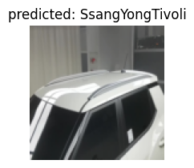
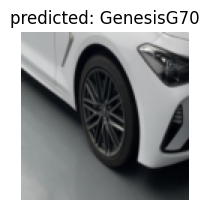

## 각종 필요한 라이브러리 설치


```python
# !pip install torch
# !pip install numpy
# !pip install torchvision
# !pip install matplotlib
# !pip install torchsummary
# !pip install split-folders[full]  # train ,val, test 데이터 분리를 위한 split-folders 설치
```

### 데이터를 train(학습) 80% / val(검증) 10% / test(테스트) 10% 로 분류


```python
# import splitfolders  
# splitfolders.ratio("../54종데이터", output="../최종테스트데이터", seed=77, ratio=(.8, .1, .1))
```

### 각종 필요한 라이브러리를 임포트


```python
from __future__ import print_function, division
import torch
import torch.nn as nn 
import torch.optim as optim
from torch.optim import lr_scheduler # 학습률 스케쥴러 임포트
import numpy as np # 넘파이 임포트
import torchvision 
from torchvision import datasets, models, transforms
import matplotlib.pyplot as plt
import time
import os
import copy

os.environ['CUDA_LAUNCH_BLOCKING'] = "1"
# os.environ['CUDA_VISIBLE_DEVICES'] = "2,3,4,5,6,7"
# os.environ['CUDA_VISIBLE_DEVICES'] = "0,1,2,3,4,5,6,7,8"
# print(device)
plt.ion()   # 대화형 모드
```


    <matplotlib.pyplot._IonContext at 0x7f125813ce50>


### 훈련 데이터 변형 및 데이터 resize


```python
data_transforms = {
	
    #훈련데이터
    'train': transforms.Compose([  # 이미지 변형시키기 여러가지 옵션들이 많으니 검색해서 원하는 옵션을 적용!
       transforms.Resize((112, 112)), # 112,112 사이즈로 이미지를 리사이즈 한다.
       transforms.RandomCrop(84), # 랜덤으로 자름 
       transforms.ColorJitter(brightness=0.2, contrast=0.2, saturation=0.2, hue=0.2), # 색 변조
        transforms.RandomHorizontalFlip(p = 1), # 수평으로 이미지 뒤집기
        transforms.ToTensor(), # 이미지 데이터를 tensor로 바꿔준다.
        transforms.Normalize([0.485, 0.456, 0.406], [0.229, 0.224, 0.225]) # 이미지 정규화
    ]),
    #검증데이터
    'val': transforms.Compose([
        transforms.Resize((112, 112)), # 이미지 사이즈를 resize로 변경한다.
        #transforms.CenterCrop(200), # 이미지 중앙을 resize × resize로 자른다
        transforms.ToTensor(), # 이미지 데이터를 tensor로 바꿔준다.
        transforms.Normalize([0.485, 0.456, 0.406], [0.229, 0.224, 0.225]) # 이미지 정규화
    ]),
	#테스트데이터
    'test': transforms.Compose([
        transforms.Resize((112, 112)), # 이미지 사이즈를 resize로 변경한다.
        #transforms.CenterCrop(200), # 이미지 중앙을 resize × resize로 자른다
        transforms.ToTensor(), # 이미지 데이터를 tensor로 바꿔준다.
        transforms.Normalize([0.485, 0.456, 0.406], [0.229, 0.224, 0.225]) # 이미지 정규화
    ]),
}

data_dir = "../최종테스트데이터" # train, val, test 경로설정

image_datasets = {x: datasets.ImageFolder(os.path.join(data_dir, x), # 설정한 경로에서 이미지를 가져오고 리사이즈에서 데이터저장
                                          data_transforms[x])
                  for x in ['train', 'val','test']}

# image_datasets = {'train': datasets.ImageFolder(root='../test4/train', transform=data_transforms['train']),
#                  'val': datasets.ImageFolder(root='../test4/val', transform=data_transforms['val']),
#                  'test': datasets.ImageFolder(root='../test4/test', transform=data_transforms['test']),
#                  }
# print(image_datasets)
```


```python
dataloaders = {x: torch.utils.data.DataLoader(image_datasets[x], batch_size=32, # 배치사이즈 32
                                             shuffle=True)
              for x in ['train', 'val', 'test']}
dataset_sizes = {x: len(image_datasets[x]) for x in ['train', 'val']}
# print(dataset_sizes)

class_names = image_datasets['train'].classes

device = torch.device("cuda" if torch.cuda.is_available() else "cpu") # gpu사용불가면 cpu를 사용.
print(device)
```

    cuda


```python
def imshow(inp, title=None): # 사용할 이미지의 일부를 보여줌(train)
    """Imshow for Tensor."""
    inp = inp.numpy().transpose((1, 2, 0))
    mean = np.array([0.485, 0.456, 0.406])
    std = np.array([0.229, 0.224, 0.225])
    inp = std * inp + mean
    inp = np.clip(inp, 0, 1)
    plt.imshow(inp)
    if title is not None:
        plt.title(title)
    plt.pause(0.001)  

inputs, classes = next(iter(dataloaders['train'])) # 학습 데이터의 배치를 얻습니다.
out = torchvision.utils.make_grid(inputs) # 배치로부터 격자 형태의 이미지를 만듭니다.

imshow(out, title=[class_names[x] for x in classes]) # 이미지 보여주기
```


    


### 사전학습 모델 불러오기
#### regnet 사용


```python
# models 사용가능 모델들 : https://pytorch.org/vision/stable/models.html 참고
# from torchvision.models import resnet50
# model = models.resnet50()
model = models.regnet_x_32gf(pretrained=True) #이미 학습된 모델 불러온다.
# print(model) #모델 구조 출력
```

    /home/jupyter-j7c102/.local/lib/python3.9/site-packages/torchvision/models/_utils.py:208: UserWarning: The parameter 'pretrained' is deprecated since 0.13 and will be removed in 0.15, please use 'weights' instead.
      warnings.warn(
    /home/jupyter-j7c102/.local/lib/python3.9/site-packages/torchvision/models/_utils.py:223: UserWarning: Arguments other than a weight enum or `None` for 'weights' are deprecated since 0.13 and will be removed in 0.15. The current behavior is equivalent to passing `weights=RegNet_X_32GF_Weights.IMAGENET1K_V1`. You can also use `weights=RegNet_X_32GF_Weights.DEFAULT` to get the most up-to-date weights.
      warnings.warn(msg)


#### 출력층을 사용하는 데이터에 맞게  out_features를 1000개에서 54개로 변형


```python
model.fc=nn.Linear(in_features=2520, out_features=54) # 마지막 출력층을 나의 class 수에 맞춰서 바꿔준다.
# print(model) # 바뀐모델 구조 출력
criterion = nn.CrossEntropyLoss() # 손실함수(loss function) 크로스 엔트로피 사용
```


```python
# model = torch.nn.DataParallel(model,device_ids=[0,1,2,3,4,5,6,7,8])
# model = torch.nn.DataParallel(model,device_ids=[0,1,2,3,4,5])
model = model.to(device) # 모델을 gpu로
```

### 최적화기법 정의 및 훈련 


```python
# 최적화 기법 설정
optimizer = optim.SGD(model.parameters(), lr=0.001, momentum=0.9) 
# optimizer sgd로 설정, 학습률 0.001

# 모델구조를 요약
# from torchsummary import summary
# summary(model, input_size=(3, 112, 112))
```


```python
# training 함수 정의
def train_model(model, criterion, optimizer, num_epochs=50): 
    since = time.time()

    best_model_wts = copy.deepcopy(model.state_dict())
    best_acc = 0.0
    train_loss, train_acc, valid_loss, valid_acc = [], [], [], []
    #     early_stopping = EarlyStopping(patience = patience, verbose = True)

    for epoch in range(num_epochs):
        print('Epoch {}/{}'.format(epoch, num_epochs - 1))
        print('-' * 10)

        # Each epoch has a training and validation phase
        for phase in ['train', 'val']:
            if phase == 'train':
                model.train()  # Set model to training mode
            else:
                model.eval()   # Set model to evaluate mode

            running_loss, running_corrects, num_cnt = 0.0, 0, 0
            
            # Iterate over data.
            for inputs, labels in dataloaders[phase]:
                inputs = inputs.to(device)
                labels = labels.to(device)

                # zero the parameter gradients
                optimizer.zero_grad()

                # forward
                # track history if only in train
                with torch.set_grad_enabled(phase == 'train'):
                    outputs = model(inputs)
                    _, preds = torch.max(outputs, 1)
                    loss = criterion(outputs, labels)

                    # backward + optimize only if in training phase
                    if phase == 'train':
                        loss.backward()
                        optimizer.step()

                # statistics
                running_loss += loss.item() * inputs.size(0)
                running_corrects += torch.sum(preds == labels.data)
                num_cnt += len(labels)
           # if phase == 'train':
            #    scheduler.step()
            
            epoch_loss = float(running_loss / num_cnt)
            epoch_acc  = float((running_corrects.double() / num_cnt).cpu()*100)
            
            if phase == 'train':
                train_loss.append(epoch_loss)
                train_acc.append(epoch_acc)
            else:
                valid_loss.append(epoch_loss)
                valid_acc.append(epoch_acc)
            print('{} Loss: {:.4f} Acc: {:.4f}'.format(phase, epoch_loss, epoch_acc))
           
            # deep copy the model 
            if phase == 'val' and epoch_acc > best_acc:
                best_idx = epoch
                best_acc = epoch_acc
                best_model_wts = copy.deepcopy(model.state_dict())
#                 best_model_wts = copy.deepcopy(model.module.state_dict())
                print('==> best model saved - %d / %.1f'%(best_idx, best_acc))

    time_elapsed = time.time() - since
    print('Training complete in {:.0f}m {:.0f}s'.format(time_elapsed // 60, time_elapsed % 60))
    print('Best valid Acc: %d - %.1f' %(best_idx, best_acc))

    # load best model weights
    model.load_state_dict(best_model_wts) # accuracy best model 을 저장 한다.
    torch.save(model.state_dict(), './54class_2.pt') # 모델을 저장할 자신의 경로 설정
    print('model saved')
    return model, best_idx, best_acc, train_loss, train_acc, valid_loss, valid_acc
```

#### 모델 학습


```python
model, best_idx, best_acc, train_loss, train_acc, valid_loss, valid_acc = train_model(model, criterion, optimizer,num_epochs=30)
```

    Epoch 0/29
    ----------
    train Loss: 2.2392 Acc: 39.9500
    val Loss: 1.5173 Acc: 69.9883
    ==> best model saved - 0 / 70.0
    Epoch 1/29
    ----------
    train Loss: 0.9121 Acc: 73.3374
    val Loss: 0.9143 Acc: 83.5706
    ==> best model saved - 1 / 83.6
    Epoch 2/29
    ----------
    train Loss: 0.5372 Acc: 84.0008
    val Loss: 0.6456 Acc: 87.9920
    ==> best model saved - 2 / 88.0
    Epoch 3/29
    ----------
    train Loss: 0.3635 Acc: 89.0670
    val Loss: 0.5349 Acc: 90.1943
    ==> best model saved - 3 / 90.2
    Epoch 4/29
    ----------
    train Loss: 0.2677 Acc: 91.7621
    val Loss: 0.4300 Acc: 91.9109
    ==> best model saved - 4 / 91.9
    Epoch 5/29
    ----------
    train Loss: 0.2036 Acc: 93.7320
    val Loss: 0.4020 Acc: 92.7483
    ==> best model saved - 5 / 92.7
    Epoch 6/29
    ----------
    train Loss: 0.1602 Acc: 95.0571
    val Loss: 0.3514 Acc: 93.0832
    ==> best model saved - 6 / 93.1
    Epoch 7/29
    ----------
    train Loss: 0.1269 Acc: 96.0645
    val Loss: 0.3021 Acc: 93.7448
    ==> best model saved - 7 / 93.7
    Epoch 8/29
    ----------
    train Loss: 0.1053 Acc: 96.7103
    val Loss: 0.2888 Acc: 93.7448
    Epoch 9/29
    ----------
    train Loss: 0.0914 Acc: 97.1565
    val Loss: 0.2981 Acc: 94.0127
    ==> best model saved - 9 / 94.0
    Epoch 10/29
    ----------
    train Loss: 0.0787 Acc: 97.5055
    val Loss: 0.2925 Acc: 94.0546
    ==> best model saved - 10 / 94.1
    Epoch 11/29
    ----------
    train Loss: 0.0685 Acc: 97.8347
    val Loss: 0.2637 Acc: 94.4900
    ==> best model saved - 11 / 94.5
    Epoch 12/29
    ----------
    train Loss: 0.0587 Acc: 98.1294
    val Loss: 0.2567 Acc: 94.7412
    ==> best model saved - 12 / 94.7
    Epoch 13/29
    ----------
    train Loss: 0.0529 Acc: 98.3489
    val Loss: 0.2550 Acc: 94.4230
    Epoch 14/29
    ----------
    train Loss: 0.0475 Acc: 98.5286
    val Loss: 0.2471 Acc: 94.8417
    ==> best model saved - 14 / 94.8
    Epoch 15/29
    ----------
    train Loss: 0.0448 Acc: 98.5694
    val Loss: 0.2300 Acc: 94.8501
    ==> best model saved - 15 / 94.9
    Epoch 16/29
    ----------
    train Loss: 0.0362 Acc: 98.8829
    val Loss: 0.2305 Acc: 95.1432
    ==> best model saved - 16 / 95.1
    Epoch 17/29
    ----------
    train Loss: 0.0378 Acc: 98.8160
    val Loss: 0.2156 Acc: 95.2102
    ==> best model saved - 17 / 95.2
    Epoch 18/29
    ----------
    train Loss: 0.0332 Acc: 98.9790
    val Loss: 0.2134 Acc: 95.0929
    Epoch 19/29
    ----------
    train Loss: 0.0305 Acc: 99.0396
    val Loss: 0.2107 Acc: 95.4195
    ==> best model saved - 19 / 95.4
    Epoch 20/29
    ----------
    train Loss: 0.0290 Acc: 99.0814
    val Loss: 0.2031 Acc: 95.3860
    Epoch 21/29
    ----------
    train Loss: 0.0262 Acc: 99.1514
    val Loss: 0.2099 Acc: 95.5116
    ==> best model saved - 21 / 95.5
    Epoch 22/29
    ----------
    train Loss: 0.0241 Acc: 99.2361
    val Loss: 0.2045 Acc: 95.2521
    Epoch 23/29
    ----------
    train Loss: 0.0250 Acc: 99.2027
    val Loss: 0.2069 Acc: 95.3944
    Epoch 24/29
    ----------
    train Loss: 0.0231 Acc: 99.2486
    val Loss: 0.1977 Acc: 95.4112
    Epoch 25/29
    ----------
    train Loss: 0.0215 Acc: 99.3354
    val Loss: 0.1958 Acc: 95.5033
    Epoch 26/29
    ----------
    train Loss: 0.0193 Acc: 99.3740
    val Loss: 0.1939 Acc: 95.7042
    ==> best model saved - 26 / 95.7
    Epoch 27/29
    ----------
    train Loss: 0.0184 Acc: 99.4388
    val Loss: 0.1958 Acc: 95.4446
    Epoch 28/29
    ----------
    train Loss: 0.0199 Acc: 99.3709
    val Loss: 0.2011 Acc: 95.4865
    Epoch 29/29
    ----------
    train Loss: 0.0180 Acc: 99.4054
    val Loss: 0.1755 Acc: 95.8885
    ==> best model saved - 29 / 95.9
    Training complete in 1649m 33s
    Best valid Acc: 29 - 95.9
    model saved


### 모델의 학습 경과를 시각화하기


```python
# 모델 시각화 train, val 의 accuracy , loss 시각화
print('best model : %d - %1.f / %.1f'%(best_idx, valid_acc[best_idx], valid_loss[best_idx]))
fig, ax1 = plt.subplots()

ax1.plot(train_acc, 'b-')
ax1.plot(valid_acc, 'r-')
plt.plot(best_idx, valid_acc[best_idx], 'ro')
ax1.set_xlabel('epoch')
# Make the y-axis label, ticks and tick labels match the line color.
ax1.set_ylabel('acc', color='k')
ax1.tick_params('y', colors='k')

ax2 = ax1.twinx()
ax2.plot(train_loss, 'g-')
ax2.plot(valid_loss, 'k-')
plt.plot(best_idx, valid_loss[best_idx], 'ro')
ax2.set_ylabel('loss', color='k')
ax2.tick_params('y', colors='k')

fig.tight_layout()
plt.show()
```

    best model : 29 - 96 / 0.2


    


### 전이학습모델 추론 및 검증 데이터 추론시각화 


```python
def visualize_model(model, num_images=6): # val 일부이미지에대한 예측값을 보여주는 함수
    was_training = model.training
    model.eval() # 모델을 검증모드로
    images_so_far = 0
    fig = plt.figure() #figure를 만들고 편집 할 수 있게 만들어주는 함수

    with torch.no_grad():
        for i, (inputs, labels) in enumerate(dataloaders['val']):
            inputs = inputs.to(device)
            labels = labels.to(device)

            outputs = model(inputs)
            _, preds = torch.max(outputs, 1)

            for j in range(inputs.size()[0]):
                images_so_far += 1
                ax = plt.subplot(num_images//2, 2, images_so_far)
                ax.axis('off')
                ax.set_title('predicted: {}'.format(class_names[preds[j]])) # 가장 높은확률의 이름 출력
                imshow(inputs.cpu().data[j]) # 예측하려고 입력된 이미지 보여주기

                if images_so_far == num_images:
                    model.train(mode=was_training)
                    return
        model.train(mode=was_training)
```


```python
for x in range(2):
    visualize_model(model) # val 이미지 모델 예측값 시각화
```


    


    


    


    


    


    


    


    


    


    


    


    


### 테스트 데이터 추론시각화 


```python
def test_visualize_model(model, num_images=4): # test 일부 이미지에대한 예측값을 보여주는 함수
    was_training = model.training
    model.eval() # 모델을 검증모드로
    images_so_far = 0
    fig = plt.figure() #figure를 만들고 편집 할 수 있게 만들어주는 함수

    with torch.no_grad():
        for i, (inputs, labels) in enumerate(dataloaders['test']):
            inputs = inputs.to(device)
            labels = labels.to(device)

            outputs = model(inputs)
            _, preds = torch.max(outputs, 1)

            for j in range(inputs.size()[0]):
                images_so_far += 1
                ax = plt.subplot(num_images//2, 2, images_so_far)
                ax.axis('off')
                ax.set_title('predicted: {}'.format(class_names[preds[j]])) # 가장 높은확률의 이름 출력
                imshow(inputs.cpu().data[j]) # 예측하려고 입력된 이미지 보여주기

                if images_so_far == num_images:
                    model.train(mode=was_training)
                    return
        model.train(mode=was_training)
```


```python
for x in range(5): #위에 코드와 같다. test 이미지에 대한 예측값을 시각화 하기 위한 것
    test_visualize_model(model) # test 이미지 모델 예측값 시각화
```



    


    


    


    


    


    


    


    


    



    


    


    


    


    


    


    


    


    


    


    


```python
!pip install sklearn
!pip install seaborn
```

    Defaulting to user installation because normal site-packages is not writeable
    Requirement already satisfied: sklearn in /home/jupyter-j7c102/.local/lib/python3.9/site-packages (0.0)
    Requirement already satisfied: scikit-learn in /home/jupyter-j7c102/.local/lib/python3.9/site-packages (from sklearn) (1.1.2)
    Requirement already satisfied: threadpoolctl>=2.0.0 in /home/jupyter-j7c102/.local/lib/python3.9/site-packages (from scikit-learn->sklearn) (3.1.0)
    Requirement already satisfied: numpy>=1.17.3 in /home/jupyter-j7c102/.local/lib/python3.9/site-packages (from scikit-learn->sklearn) (1.23.2)
    Requirement already satisfied: joblib>=1.0.0 in /home/jupyter-j7c102/.local/lib/python3.9/site-packages (from scikit-learn->sklearn) (1.1.0)
    Requirement already satisfied: scipy>=1.3.2 in /home/jupyter-j7c102/.local/lib/python3.9/site-packages (from scikit-learn->sklearn) (1.9.1)
    Defaulting to user installation because normal site-packages is not writeable
    Requirement already satisfied: seaborn in /home/jupyter-j7c102/.local/lib/python3.9/site-packages (0.12.0)
    Requirement already satisfied: pandas>=0.25 in /home/jupyter-j7c102/.local/lib/python3.9/site-packages (from seaborn) (1.4.4)
    Requirement already satisfied: matplotlib>=3.1 in /home/jupyter-j7c102/.local/lib/python3.9/site-packages (from seaborn) (3.5.3)
    Requirement already satisfied: numpy>=1.17 in /home/jupyter-j7c102/.local/lib/python3.9/site-packages (from seaborn) (1.23.2)
    Requirement already satisfied: cycler>=0.10 in /home/jupyter-j7c102/.local/lib/python3.9/site-packages (from matplotlib>=3.1->seaborn) (0.11.0)
    Requirement already satisfied: pillow>=6.2.0 in /home/jupyter-j7c102/.local/lib/python3.9/site-packages (from matplotlib>=3.1->seaborn) (9.2.0)
    Requirement already satisfied: python-dateutil>=2.7 in /opt/tljh/user/lib/python3.9/site-packages (from matplotlib>=3.1->seaborn) (2.8.2)
    Requirement already satisfied: pyparsing>=2.2.1 in /opt/tljh/user/lib/python3.9/site-packages (from matplotlib>=3.1->seaborn) (3.0.9)
    Requirement already satisfied: fonttools>=4.22.0 in /home/jupyter-j7c102/.local/lib/python3.9/site-packages (from matplotlib>=3.1->seaborn) (4.37.1)
    Requirement already satisfied: kiwisolver>=1.0.1 in /home/jupyter-j7c102/.local/lib/python3.9/site-packages (from matplotlib>=3.1->seaborn) (1.4.4)
    Requirement already satisfied: packaging>=20.0 in /opt/tljh/user/lib/python3.9/site-packages (from matplotlib>=3.1->seaborn) (21.3)
    Requirement already satisfied: pytz>=2020.1 in /opt/tljh/user/lib/python3.9/site-packages (from pandas>=0.25->seaborn) (2022.2.1)
    Requirement already satisfied: six>=1.5 in /opt/tljh/user/lib/python3.9/site-packages (from python-dateutil>=2.7->matplotlib>=3.1->seaborn) (1.16.0)


### Confusion Matrix 그리기


```python
# 각 항목별 정확도 및 컨퓨전 매트릭스 
from sklearn.metrics import classification_report
import matplotlib.pyplot as plt 
nb_classes = 54

confusion_matrix = torch.zeros(nb_classes, nb_classes)
with torch.no_grad():
    for i, (inputs, classes) in enumerate(dataloaders['test']):
        inputs = inputs.to(device)
        classes = classes.to(device)
        outputs = model(inputs)
        _, preds = torch.max(outputs, 1)
        for t, p in zip(classes.view(-1), preds.view(-1)):
                confusion_matrix[t.long(), p.long()] += 1


# print('        g80', '    gv80', '   Selots', ' avateAD', 'sonataLF', 'tucson17')
print(confusion_matrix.diag()/confusion_matrix.sum(1))
```

    tensor([0.9425, 0.9008, 0.9494, 0.9725, 0.9758, 0.9610, 0.9550, 0.9750, 0.9766,
            0.9854, 0.9529, 0.9875, 0.9618, 0.9746, 0.9387, 0.8596, 0.9672, 0.9385,
            0.9599, 0.9932, 0.9856, 0.9648, 0.9876, 0.9639, 0.9590, 0.9824, 0.9451,
            0.9833, 0.9162, 0.9627, 0.9433, 0.9379, 0.9182, 0.9534, 0.9412, 0.9804,
            0.9965, 0.9538, 0.9954, 0.9636, 0.9510, 0.9806, 0.9799, 0.9579, 0.9467,
            0.9669, 0.9725, 0.9686, 0.9561, 0.9737, 0.9558, 0.9659, 0.9946, 0.9721])


```python
# 컨퓨전 매트릭스 heatmap 그리기
import seaborn as sns

ax= plt.subplot()
sns.heatmap(confusion_matrix, annot=True, fmt='g', ax=ax);  #annot=True to annotate cells, ftm='g' to disable scientific notation

# labels, title and ticks
ax.set_xlabel('Predicted labels');ax.set_ylabel('True labels'); 
ax.set_title('Confusion Matrix'); 
# ax.xaxis.set_ticklabels(['g80', 'gv80', 'Selots', 'avateAD', 'sonataLF', 'tucson17']); ax.yaxis.set_ticklabels(['g80', 'gv80', 'Selots', 'avateAD', 'sonataLF', 'tucson17']);
```


    


### 저장된 모델 불러오기 


```python
from torchvision import models
import torch

model=models.regnet_x_32gf(pretrained=False)
model.fc=nn.Linear(in_features=2520, out_features=54) 

model.load_state_dict(torch.load("./54class_2.pt", map_location=torch.device('cpu')))
model = model.to(device)
```

    /home/jupyter-j7c102/.local/lib/python3.9/site-packages/torchvision/models/_utils.py:208: UserWarning: The parameter 'pretrained' is deprecated since 0.13 and will be removed in 0.15, please use 'weights' instead.
      warnings.warn(
    /home/jupyter-j7c102/.local/lib/python3.9/site-packages/torchvision/models/_utils.py:223: UserWarning: Arguments other than a weight enum or `None` for 'weights' are deprecated since 0.13 and will be removed in 0.15. The current behavior is equivalent to passing `weights=None`.
      warnings.warn(msg)


```python
def test_visualize_model(model, num_images=2): # test Image  예측값을 보여주는 함수
    was_training = model.training
    model.eval() # 모델을 검증모드로
    images_so_far = 0
    fig = plt.figure() # figure를 만들고 편집 할 수 있게 만들어주는 함수

    with torch.no_grad():
        for i, (inputs, labels) in enumerate(dataloaders['test']):
            inputs = inputs.to(device)
            labels = labels.to(device)

            outputs = model(inputs)
            _, preds = torch.max(outputs, 1)

            for j in range(inputs.size()[0]):
                images_so_far += 1
                ax = plt.subplot(num_images//2, 2, images_so_far)
                ax.axis('off')
                ax.set_title('predicted: {}'.format(class_names[preds[j]])) # 가장 높은확률의 이름 출력
                imshow(inputs.cpu().data[j]) # 예측하려고 입력된 이미지 보여주기

                if images_so_far == num_images:
                    model.train(mode=was_training)
                    return
        model.train(mode=was_training)
```


```python
for x in range(20): # 2개씩 20번 반복 40장
      test_visualize_model(model) # test 이미지 모델 예측값 시각화
```


    


    


    


    


    


    


    


    


    


    


    


    


    


    


    


    


    


    


    


    


    


    


    


    


    


    


    


    


    


    


    


    


    


    


    


    


    


    


    


    
